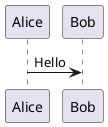
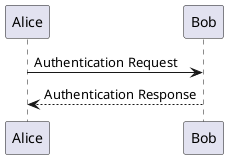
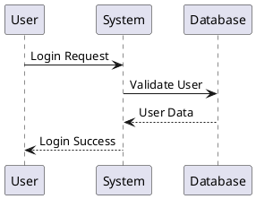
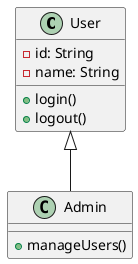
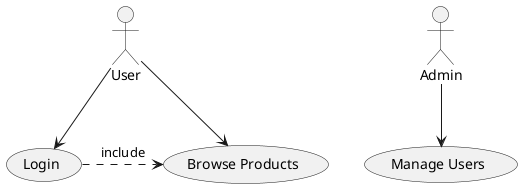
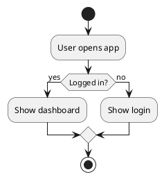
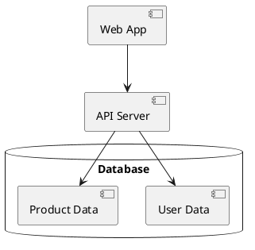
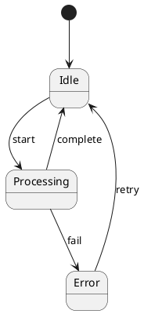
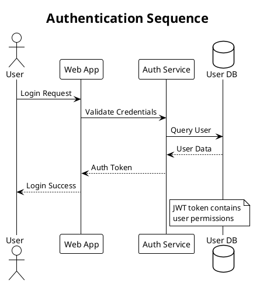
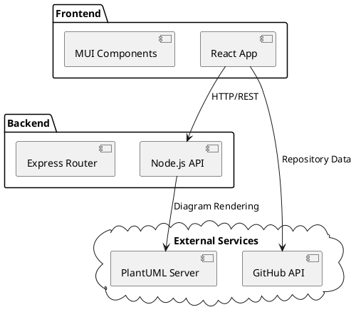

# PlantUML Integration Documentation

## Overview

MarkDown Buddy supports PlantUML diagram rendering alongside Mermaid diagrams. PlantUML diagrams are automatically converted to SVG images using the official PlantUML web service.

## Supported Syntax

### Code Block Languages

PlantUML diagrams can be written using either of these code block languages:

```markdown

```

```markdown
```puml
Bob -> Alice: Hi there!
```
```

### Auto-wrapping

If you don't include `@startuml`/`@enduml` tags, they will be automatically added:

```markdown
```puml
Alice -> Bob: Authentication Request
Bob --> Alice: Authentication Response
```
```

This is equivalent to:

```markdown

```

## Supported Diagram Types

PlantUML supports a wide variety of UML and non-UML diagrams:

### Sequence Diagrams


### Class Diagrams


### Use Case Diagrams


### Activity Diagrams


### Component Diagrams


### State Diagrams


## Technical Implementation

### Architecture Overview

```
Markdown → Code Block Detection → PlantUML Encoding → External Server → SVG Rendering
```

### Processing Pipeline

1. **Markdown Parsing**: Code blocks with `plantuml` or `puml` language are identified
2. **Code Extraction**: PlantUML syntax is extracted from the code block
3. **Auto-wrapping**: `@startuml`/`@enduml` tags are added if missing
4. **Encoding**: PlantUML code is encoded using `plantuml-encoder` library
5. **URL Generation**: Encoded string is used to create PlantUML server URL
6. **SVG Loading**: Browser loads SVG image from PlantUML server
7. **DOM Replacement**: Original code block is replaced with rendered diagram

### External Dependencies

- **PlantUML Server**: `https://www.plantuml.com/plantuml`
- **Encoder Library**: `plantuml-encoder` npm package
- **Output Format**: SVG (Scalable Vector Graphics)

### Code Flow

```typescript
// 1. Code block detection
const plantUMLBlocks = container.querySelectorAll('pre code.language-plantuml, pre code.language-puml');

// 2. Code processing
let cleanCode = plantUMLCode.trim();
if (!cleanCode.startsWith('@start')) {
  cleanCode = `@startuml\n${cleanCode}\n@enduml`;
}

// 3. Encoding and URL generation
const encoded = plantumlEncoder.encode(cleanCode);
const imageUrl = `https://www.plantuml.com/plantuml/svg/${encoded}`;

// 4. Image rendering
const img = document.createElement('img');
img.src = imageUrl;
```

## Features

### ✅ Supported Features

- **Multiple Diagram Types**: Sequence, Class, Use Case, Activity, Component, State, Object, Deployment
- **Auto-wrapping**: Automatic `@startuml`/`@enduml` addition
- **SVG Output**: High-quality scalable vector graphics
- **Error Handling**: Clear error messages for invalid syntax
- **Loading States**: Visual feedback during diagram generation
- **Mixed Content**: PlantUML works alongside Mermaid and regular markdown
- **Responsive Design**: Diagrams scale with container width

### 🔄 Loading States

1. **Loading**: "Loading PlantUML diagram..." message displayed
2. **Success**: Diagram replaces loading message
3. **Error**: Error message replaces loading message

### 🎨 Styling

PlantUML diagrams are wrapped in containers with:
- Border and padding for visual separation
- Centered alignment
- Responsive width (max-width: 100%)
- White background
- Error styling for failed renders

## Limitations

### ❌ Current Limitations

- **Internet Required**: Diagrams require internet connection to PlantUML server
- **External Dependency**: Relies on PlantUML.com availability
- **Privacy**: Diagram code is sent to external server
- **Performance**: Rendering speed depends on network and server response time

### 🔒 Security Considerations

- PlantUML code is transmitted to external server (plantuml.com)
- No sensitive information should be included in diagrams
- Server is operated by PlantUML maintainers (trusted source)

## Examples and Best Practices

### Simple Diagrams

For quick sketches, minimal syntax works:

```puml
A -> B
B -> C
C -> A
```

### Complex Diagrams

For detailed documentation, use full syntax:



### Embedded Documentation

PlantUML works great for embedding architecture diagrams in documentation:



## Troubleshooting

### Common Issues

1. **Loading message doesn't disappear**
   - Check internet connection
   - Verify PlantUML server is accessible
   - Check browser console for errors

2. **Syntax errors**
   - Ensure proper PlantUML syntax
   - Check for typos in keywords
   - Validate diagram locally if possible

3. **Diagrams not rendering**
   - Confirm code block uses `plantuml` or `puml` language
   - Check browser developer tools for network errors
   - Try simpler diagram syntax

### Debug Steps

1. Open browser developer console
2. Look for PlantUML-related error messages
3. Check network tab for failed requests to plantuml.com
4. Verify diagram syntax using online PlantUML editor

## Integration with MarkDown Buddy

PlantUML diagrams integrate seamlessly with other MarkDown Buddy features:

- **Focus Mode**: Diagrams display properly in distraction-free reading mode
- **Session Persistence**: Rendered diagrams persist across app sessions
- **Responsive Design**: Diagrams scale on mobile devices
- **Mixed Content**: Use alongside Mermaid diagrams and regular markdown

## Future Enhancements

Potential improvements for PlantUML integration:

- **Local Rendering**: Java-based local PlantUML processing
- **Caching**: Cache rendered diagrams for offline viewing
- **Custom Themes**: Support for PlantUML themes and styling
- **Export Options**: Download diagrams as PNG/SVG files
- **Syntax Validation**: Real-time syntax checking before rendering