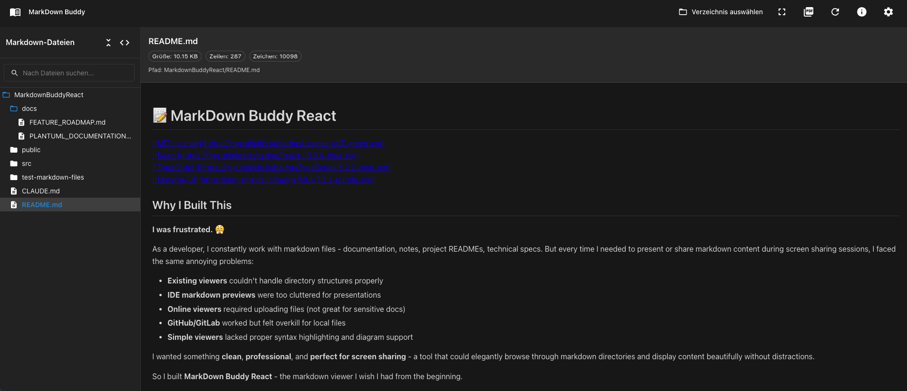
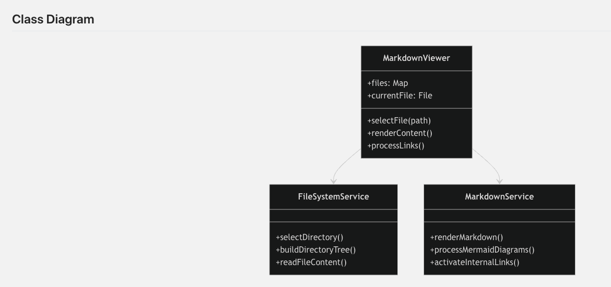
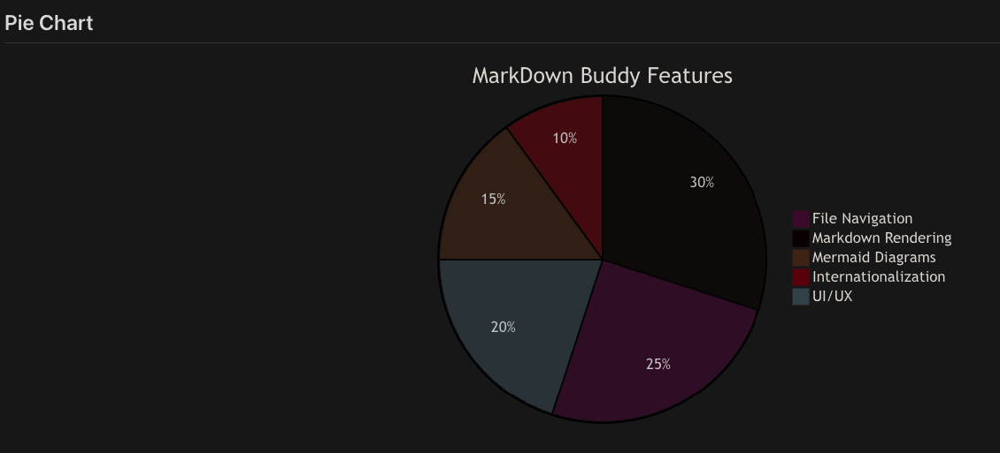
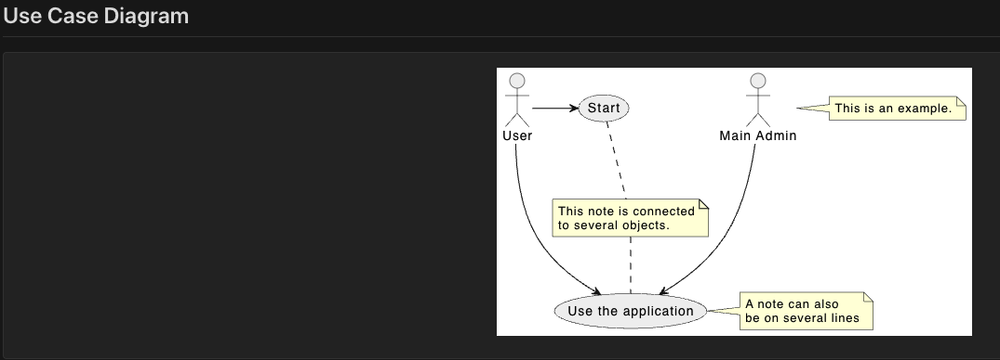

# 📝 MarkDown Buddy React

[](https://choosealicense.com/licenses/mit/)
[](https://reactjs.org/)
[](https://www.typescriptlang.org/)
[](https://mui.com/)

## Why I Built This

**I was frustrated.** 😤 

As a developer, I constantly work with markdown files - documentation, notes, project READMEs, technical specs. But every time I needed to present or share markdown content during screen sharing sessions, I faced the same annoying problems:

- **Existing viewers** couldn't handle directory structures properly
- **IDE markdown previews** were too cluttered for presentations  
- **Online viewers** required uploading files (not great for sensitive docs)
- **GitHub/GitLab** worked but felt overkill for local files
- **Simple viewers** lacked proper syntax highlighting and diagram support

I wanted something **clean**, **professional**, and **perfect for screen sharing** - a tool that could elegantly browse through markdown directories and display content beautifully without distractions.

So I built **MarkDown Buddy React** - the markdown viewer I wish I had from the beginning.

## What Makes It Special

A modern, elegant Markdown viewer and editor with Material-UI components, featuring an intuitive two-panel interface for browsing and viewing markdown files with live rendering, syntax highlighting, diagrams, and advanced features like PDF export and dark mode.

## 🖼️ Screenshots

> **Note**: Screenshots will be added once the repository is made public and deployed.

### Light Mode


### Dark Mode  


### Diagram Support





## ✨ Features

### 🎨 **Advanced Markdown Support**
- **Live Rendering**: GitHub-flavored markdown with instant preview
- **Syntax Highlighting**: 180+ programming languages with highlight.js
- **Mermaid Diagrams**: Flowcharts, sequence diagrams, class diagrams, and more
- **PlantUML Support**: UML diagrams with online rendering
- **Internal Link Navigation**: Seamless navigation between markdown files

### 🎛️ **Modern Interface**
- **Material Design**: Clean, professional UI with Material-UI components
- **Dark Mode**: Eye-friendly dark theme with automatic system detection
- **Responsive Design**: Perfect experience on desktop, tablet, and mobile
- **Focus Mode**: Distraction-free reading experience
- **Settings Panel**: Comprehensive customization options

### 📁 **File Management**
- **Directory Browser**: Recursive exploration with intelligent filtering
- **Session Persistence**: Remembers last opened folder and files
- **File Statistics**: Size, line count, and character information
- **Auto-refresh**: Detects external file changes with notification

### 🌍 **Internationalization & Export**
- **Multi-language**: German and English interface
- **PDF Export**: Professional PDF generation with embedded diagrams
- **VS Code Integration**: Open files directly in your favorite editor
- **Keyboard Shortcuts**: Efficient navigation and controls

## 🚀 Getting Started

### Prerequisites

- Node.js 18+ 
- npm or yarn

### Installation

1. Clone the repository:
```bash
git clone https://github.com/erichrutz/markdown-buddy-react.git
cd markdown-buddy-react
```

2. Install dependencies:
```bash
npm install
```

3. Start the development server:
```bash
npm run dev
```

4. Open your browser to `http://localhost:5173` (default Vite port)

### Building for Production

```bash
npm run build
```

The built files will be in the `dist` directory.

## 🧪 Testing

```bash
# Run tests
npm test

# Generate coverage report  
npm run test:coverage

# Run tests once
npm run test:run
```

## 📖 Usage

Perfect for presentations, documentation reviews, and screen sharing:

1. **Select a Directory**: Click "Select Folder" to choose your documentation folder
2. **Browse Files**: Clean file tree navigation on the left
3. **Present Content**: Click any `.md` file for beautiful, distraction-free viewing
4. **Navigate Links**: Internal markdown links work seamlessly
5. **Customize Appearance**: Settings for fonts, themes, and presentation modes
6. **Export PDFs**: Generate professional PDFs with embedded diagrams
7. **Focus Mode**: Full-screen for presentations and screen sharing
8. **Multi-language**: German/English interface

### Perfect For:
- 📊 **Presenting documentation** during meetings
- 🖥️ **Screen sharing** technical content  
- 📚 **Browsing large documentation** projects
- 🎯 **Distraction-free reading** of markdown files
- 📄 **Generating PDFs** from markdown content

## 🛠️ Built With

### Core Technologies
- **[React 18](https://reactjs.org/)** - Modern UI library with hooks and concurrent features
- **[TypeScript](https://www.typescriptlang.org/)** - Type safety and enhanced developer experience
- **[Material-UI (MUI)](https://mui.com/)** - React component library following Material Design
- **[Vite](https://vitejs.dev/)** - Lightning-fast build tool and development server

### Markdown & Rendering
- **[marked.js](https://marked.js.org/)** - Fast markdown parser and compiler
- **[highlight.js](https://highlightjs.org/)** - Syntax highlighting for 180+ languages
- **[Mermaid.js](https://mermaid.js.org/)** - Diagrams and flowcharts from text
- **[PlantUML](https://plantuml.com/)** - UML diagram generation

### Additional Features
- **[react-i18next](https://react.i18next.com/)** - Internationalization framework
- **[jsPDF](https://github.com/parallax/jsPDF)** - PDF generation in the browser
- **[html2canvas](https://html2canvas.hertzen.com/)** - Screenshot functionality for diagrams

## 📁 Project Structure

```
src/
├── components/           # React components
│   ├── AboutDialog.tsx      # About dialog with license info
│   ├── AppHeader.tsx        # Main navigation header
│   ├── ErrorBoundary.tsx    # Error handling boundary
│   ├── FileTree.tsx         # File system navigation
│   ├── MarkdownViewer.tsx   # Markdown content renderer
│   ├── PDFExportDialog.tsx  # PDF export configuration
│   └── SettingsDialog.tsx   # Application settings
├── hooks/               # Custom React hooks
│   ├── useFileSystem.ts     # File system operations
│   ├── useKeyboardShortcuts.ts # Keyboard navigation
│   ├── useMarkdown.ts       # Markdown processing
│   ├── usePDFExport.ts      # PDF generation
│   ├── useSession.ts        # Session persistence
│   └── useSettings.ts       # Settings management
├── services/            # Business logic services
│   ├── fileSystemService.ts # File operations
│   ├── markdownService.ts   # Markdown parsing
│   ├── pdfExportService.ts  # PDF generation
│   ├── sessionService.ts    # Local storage
│   └── vscodeService.ts     # VS Code integration
├── i18n/               # Internationalization
│   ├── i18n.ts             # i18next configuration
│   └── translations.ts     # Language translations
├── theme/              # Material-UI theming
│   └── theme.ts            # Theme configuration
├── types/              # TypeScript definitions
│   └── settings.ts         # Settings type definitions
├── styles/             # Global styles
│   └── markdown.css        # Markdown-specific styling
└── App.tsx             # Main application component
```

## 🎨 Features in Detail

### File System Support
- Modern File System Access API with fallback to legacy file input
- Automatic filtering of ignored directories (node_modules, .git, etc.)
- Support for .md and .markdown files

### Markdown Rendering
- GitHub Flavored Markdown support
- Syntax highlighting for 180+ programming languages
- Responsive tables and lists
- Custom link handling for internal navigation

### Mermaid Diagrams
Supports all Mermaid diagram types:
- Flowcharts
- Sequence diagrams
- Class diagrams
- State diagrams
- Gantt charts
- Pie charts
- Git graphs

### Session Management
- Automatic saving of last opened folder and file
- Persistent folder expansion state
- Language preference storage

## 🌐 Browser Support

- Chrome/Edge 88+
- Firefox 85+
- Safari 14+
- Mobile browsers with responsive design

## 🔧 Configuration

### Ignored Directories
Edit `src/types/index.ts` to modify the list of ignored directories:

```typescript
export const IGNORED_DIRECTORIES = [
  'node_modules', '.git', '.vscode', 'dist', 'build'
];
```

### Supported File Extensions
Modify the supported file extensions in `src/types/index.ts`:

```typescript
export const SUPPORTED_FORMATS = ['.md', '.markdown'];
```

### Theme Customization
Edit `src/theme/theme.ts` to customize colors and styling.

## 🤝 Contributing

Contributions are welcome! Here's how you can help:

1. **Fork the repository**
2. **Create a feature branch**: `git checkout -b feature/amazing-feature`
3. **Commit your changes**: `git commit -m 'Add some amazing feature'`
4. **Push to the branch**: `git push origin feature/amazing-feature`
5. **Open a Pull Request**

### Development Guidelines
- Follow the existing code style and TypeScript patterns
- Add appropriate tests for new features
- Update documentation for significant changes
- Ensure all linting and type checking passes

### Issues and Feature Requests
- Use the GitHub Issues tab to report bugs or request features
- Provide detailed information about your environment and use case
- Check existing issues before creating new ones

## 📄 License

This project is licensed under the MIT License - see the [LICENSE](LICENSE) file for details.

## 👤 Author

**Erich Rutz**
- GitHub: [@erichrutz](https://github.com/erichrutz)

## 🙏 Acknowledgments

- Material-UI team for the excellent component library
- The React community for inspiration and best practices
- All open-source contributors whose libraries make this project possible

---

**Made with ❤️ by [Erich Rutz](https://github.com/erichrutz)**