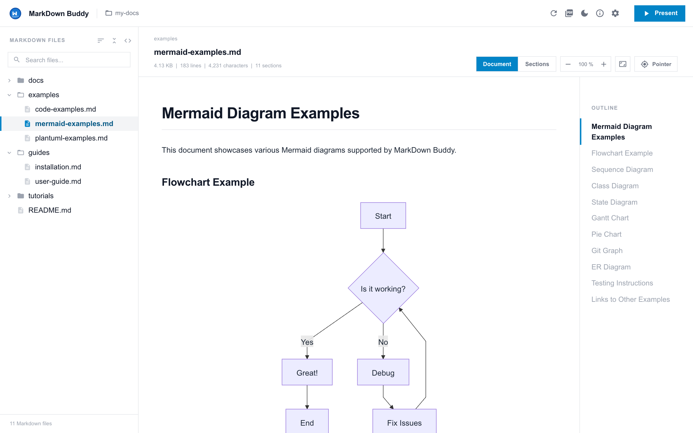
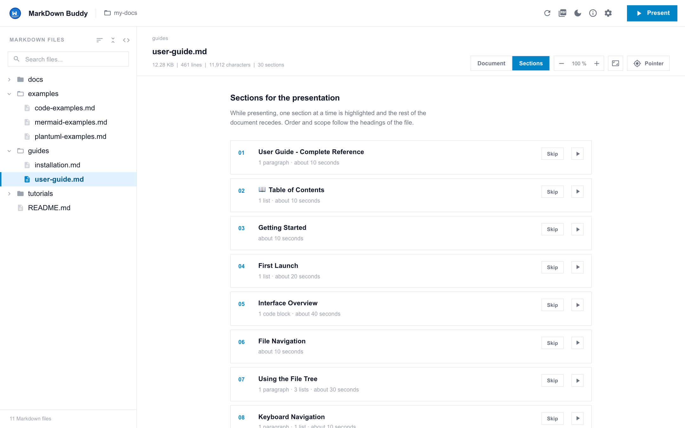
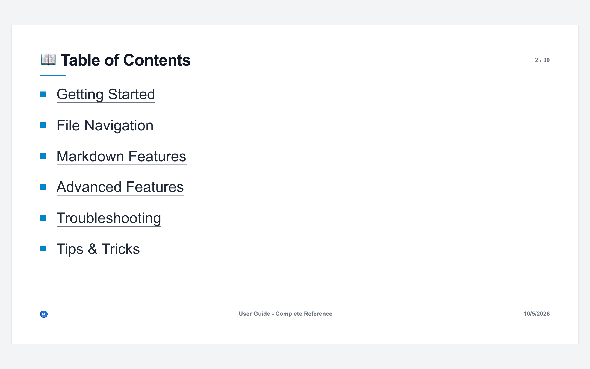
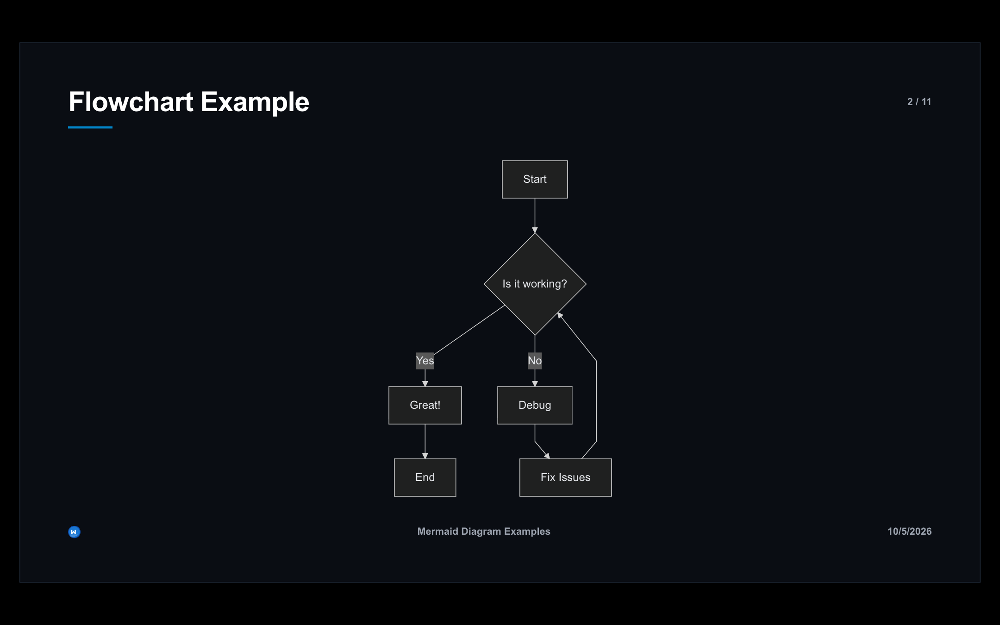

# MarkDown Buddy

**Browse, read and present folders of Markdown files, right in your browser. Nothing gets uploaded.**

[](https://github.com/erichrutz/markdown-buddy-react/actions/workflows/ci.yml)
[](LICENSE)
[](https://react.dev/)
[](https://www.typescriptlang.org/)
[](https://vitejs.dev/)

**[Try it online](https://erichrutz.github.io/markdown-buddy-react/)**: no installation needed, works best in Chrome or Edge.


## Why I built this

I work with Markdown all day: documentation, notes, READMEs, specs. Whenever I had to show that content in a meeting or during screen sharing, the existing options fell short:

- IDE previews are cluttered and don't handle a whole folder well.
- Online viewers want you to upload files, which is a no-go for internal docs.
- GitHub or GitLab works, but feels like overkill for local files.
- Simple viewers lack syntax highlighting and diagrams.
- Turning a document into slides means copying everything into PowerPoint.

MarkDown Buddy is the tool I wanted: point it at a folder, read comfortably, and present any document as slides with one click.

## Features

**Reading**
- File tree for a whole folder, with search, and `node_modules`, `.git` and similar folders skipped automatically
- GitHub-flavored Markdown with syntax highlighting for 180+ languages
- [Mermaid](https://mermaid.js.org/) and [PlantUML](https://plantuml.com/) diagrams
- Local images, including relative paths across folders
- YAML frontmatter rendered as a clean key/value table (handy for agent skill files such as `SKILL.md`)
- Links between Markdown files navigate inside the app
- Clickable outline of the current document
- Zoom, adjustable reading width, light and dark theme (follows the system by default)

**Presenting**
- Every section of a document becomes a 16:9 slide, and text scales automatically to fit
- Long sections are split across several slides
- Build mode reveals list items one at a time
- Skip sections you don't need, or start presenting from any section
- Laser pointer and text marker for screen sharing (also available in the document view)
- Separate light/dark theme for the slides
- Header and footer of the slides are configurable (see [Presentation config](#presentation-config))

**Other**
- PDF export with embedded diagrams
- Opens the current file in VS Code
- English and German interface
- Remembers the last folder, file and expanded folders

## Screenshots

| Dark theme | Diagrams |
|---|---|
|  |  |

| Preparing a presentation | Presenting |
|---|---|
|  |  |



## Getting started

### Use it online

Open **https://erichrutz.github.io/markdown-buddy-react/** and click **Open folder**. Your browser asks for permission to read the folder; the files are only read locally.

### Run it locally

You need **Node.js 20.19 or newer** and npm.

```bash
git clone https://github.com/erichrutz/markdown-buddy-react.git
cd markdown-buddy-react
npm install
npm run dev
```

The app opens at http://localhost:3002. If that port is in use, Vite picks another one and prints it in the terminal.

To build a static version for any web server:

```bash
npm run build
```

The output lands in `dist/`. Production builds use the base path `/markdown-buddy-react/` (for GitHub Pages); change `base` in `vite.config.ts` if you host it elsewhere.

## How to present

1. Open a folder and select a document.
2. Optional: switch to the **Sections** tab, skip sections you don't need, or press ▶ next to a section to start from there.
3. Click **Present**. The browser switches to fullscreen if allowed.
4. Use the keyboard to move through the slides. Move the mouse to the left or top edge, or press `S`, to show the controls.
5. Press `Esc` to return to the document.

Select text in the document view to highlight it with the marker; click a highlight to remove it. Highlights are carried over to the slides.

### Presentation shortcuts

| Key | Action |
|---|---|
| `↓` `Space` `PageDown` | Next step: reveal the next list item, next part of the section, or next slide |
| `↑` `PageUp` | Previous step |
| `→` / `←` | Next / previous section |
| `B` | Build mode on/off |
| `P` | Laser pointer on/off |
| `D` | Light/dark slides |
| `S` | Show or hide the controls |
| `Esc` | Exit the presentation |

### App shortcuts

`Ctrl` on Windows and Linux, `⌘` on macOS.

| Key | Action |
|---|---|
| `Ctrl/⌘ + O` | Open a folder |
| `Ctrl/⌘ + R` | Reload the current file |
| `Ctrl/⌘ + P` | Export as PDF |
| `Ctrl/⌘ + Shift + K` | Collapse all folders |
| `Ctrl/⌘ + +` / `-` / `0` | Zoom in / out / reset |
| `?` | Show all shortcuts |

## Presentation config

The slide header and footer are defined in [`public/presentation/config.json`](public/presentation/config.json). Edit it to add your logo, team name or other details. If the file is missing or invalid, built-in defaults are used.

```json
{
  "defaults": { "team": "" },
  "activeHeader": "default",
  "activeFooter": "standard",
  "headers": {
    "default": {
      "left":  [{ "type": "text", "value": "{sectionTitle}{continuation}", "variant": "title" }],
      "right": [{ "type": "text", "value": "{sectionNumber} / {sectionCount}", "variant": "meta" }]
    }
  },
  "footers": {
    "standard": {
      "left":   [{ "type": "icon", "src": "icons/logo.svg", "height": 18 }],
      "center": [{ "type": "text", "value": "{documentTitle}", "variant": "meta" }],
      "right":  [{ "type": "text", "value": "{date}", "variant": "meta" }]
    }
  }
}
```

- You can define several headers and footers; `activeHeader` and `activeFooter` select which one is used.
- Each band has `left`, `center` and `right` slots containing a list of elements.
- `text` elements have a `variant` of `title`, `normal` or `meta`.
- `icon` elements point to a file relative to `public/presentation/`.
- Available placeholders: `{sectionTitle}`, `{continuation}`, `{documentTitle}`, `{fileName}`, `{sectionNumber}`, `{sectionCount}`, `{pageNumber}`, `{pageCount}`, `{date}`, `{time}`, `{author}`.
- `{author}` comes from an `author:` field in the document's frontmatter and falls back to `defaults.team`.

## Privacy and browser support

- **Your files stay on your machine.** The app is a static website; files are read in the browser and never uploaded.
- **Exception: PlantUML.** PlantUML diagrams are rendered by the public server at `plantuml.com`, so the diagram source is sent there. Mermaid diagrams are rendered locally. Avoid PlantUML for confidential content.
- Rendered HTML is sanitized with [DOMPurify](https://github.com/cure53/DOMPurify).

| Browser | Support |
|---|---|
| Chrome, Edge and other Chromium-based browsers | Full support via the [File System Access API](https://developer.mozilla.org/docs/Web/API/File_System_API); **Reload** always reads the latest version from disk |
| Firefox, Safari | Folders are opened through the standard folder upload dialog; files are read once, so to see changes on disk, open the folder again |

The text marker uses the [CSS Custom Highlight API](https://developer.mozilla.org/docs/Web/API/CSS_Custom_Highlight_API). In browsers without it, the marker is simply unavailable.

## Configuration

| What | Where |
|---|---|
| Folders to skip, supported file extensions | `src/types/index.ts` (`IGNORED_DIRECTORIES`, `SUPPORTED_FORMATS`) |
| Colors, surfaces and accent color | `src/theme/designTokens.ts`, `src/theme/palette.ts` |
| MUI theme | `src/theme/theme.ts` |
| Slide header and footer | `public/presentation/config.json` |
| Translations | `src/i18n/translations.ts` |

## Development

```bash
npm run dev            # start the dev server
npm test               # run tests in watch mode
npm run test:run       # run tests once
npm run test:coverage  # coverage report
npm run lint           # ESLint
npm run build          # type check and production build
```

```
src/
├── components/   UI: file tree, viewer, document header, presentation mode, dialogs
├── hooks/        state and behavior: files, settings, session, shortcuts, text marker
├── services/     file system access, Markdown rendering, PlantUML, images, PDF export
├── utils/        section parsing, slide pagination, presentation config, text anchors
├── theme/        design tokens, palette and MUI theme
├── i18n/         English and German translations
└── types/        shared TypeScript types
public/
├── presentation/         slide header/footer config and icons
└── test-markdown-files/  sample documents for manual testing
```

Built with [React](https://react.dev/), [TypeScript](https://www.typescriptlang.org/), [MUI](https://mui.com/), [Vite](https://vitejs.dev/), [marked](https://marked.js.org/), [highlight.js](https://highlightjs.org/), [Mermaid](https://mermaid.js.org/), [jsPDF](https://github.com/parallax/jsPDF), [html2canvas](https://html2canvas.hertzen.com/) and [i18next](https://www.i18next.com/).

## Contributing

Issues and pull requests are welcome. Before opening a pull request, please make sure `npm run lint`, `npm run test:run` and `npm run build` pass, and add tests for new logic.

## License

[MIT](LICENSE) © Erich Rutz
