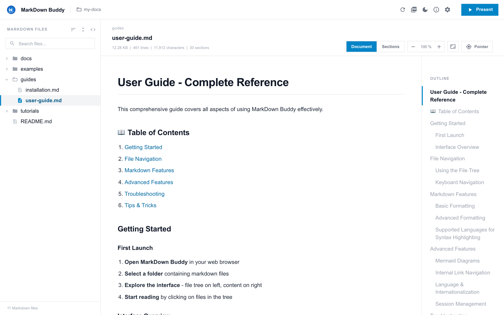
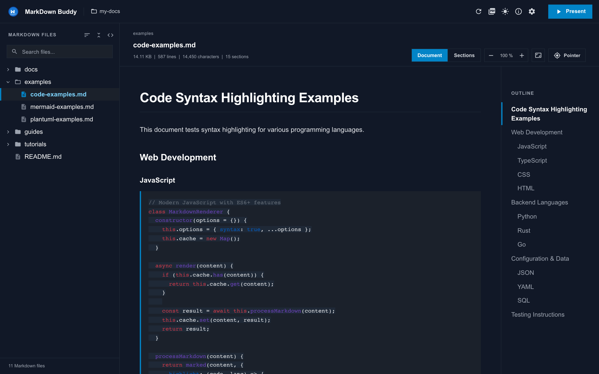
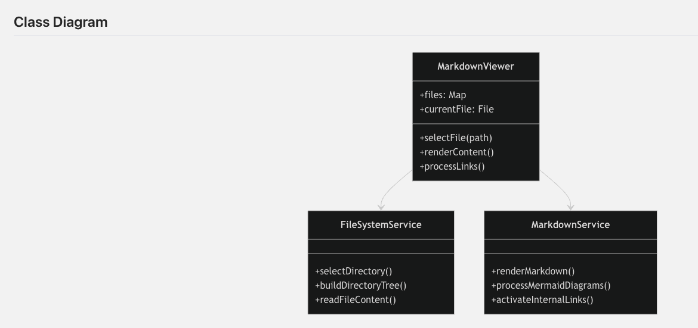
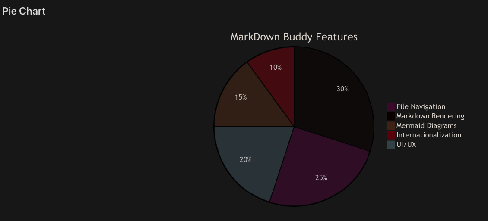
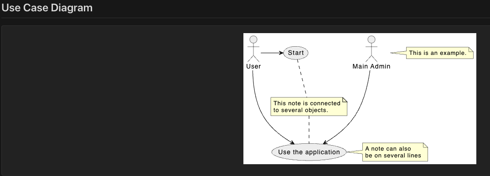

# MarkDown Buddy

[](https://choosealicense.com/licenses/mit/)
[](https://reactjs.org/)
[](https://www.typescriptlang.org/)
[](https://mui.com/)

## Why I Built This

**I was frustrated.** 😤 

As a developer, I constantly work with markdown files - documentation, notes, project READMEs, technical specs. But every time I needed to present or share markdown content during screen sharing sessions, I faced the same annoying problems:

- **Existing viewers** couldn't handle directory structures properly
- **IDE markdown previews** were too cluttered for presentations  
- **Online viewers** required uploading files (not great for sensitive docs)
- **GitHub/GitLab** worked but felt overkill for local files
- **Simple viewers** lacked proper syntax highlighting and diagram support

I wanted something **clean**, **professional**, and **perfect for screen sharing** - a tool that could elegantly browse through markdown directories and display content beautifully without distractions.

So I built **MarkDown Buddy** - the markdown viewer I wish I had from the beginning.

## What Makes It Special

A modern, elegant Markdown viewer with Material-UI components, featuring an intuitive two-panel interface for browsing and viewing markdown files with live rendering, syntax highlighting, diagrams, and advanced features like PDF export, dark mode, and a full **presentation mode** that turns any markdown document into a slide-by-slide presentation without leaving the app.

## Screenshots

### Light Mode


### Dark Mode  


### Diagram Support




## ✨ Features

### **Advanced Markdown Support**
- **Live Rendering**: GitHub-flavored markdown with instant preview
- **Syntax Highlighting**: 180+ programming languages with highlight.js
- **Mermaid Diagrams**: Flowcharts, sequence diagrams, class diagrams, and more
- **PlantUML Support**: UML diagrams with online rendering
- **Frontmatter Tables**: YAML frontmatter (metadata between `---` lines, e.g. agent skill files) is rendered as a clean key/value table in both document and presentation mode
- **Internal Link Navigation**: Seamless navigation between markdown files

### **Presentation Mode**
- **Slide-based view**: Each markdown section becomes a slide (16:9 aspect ratio)
- **Auto-fit text**: Content automatically scales to fill the slide
- **Build mode**: Reveal list items one at a time (toggle with `B`)
- **Section management**: Skip or include sections from the "Abschnitte" tab
- **Collapsible controls**: Sidebar and header auto-hide; bring back with `S` or mouse at screen edge
- **Laser pointer**: Visual pointer overlay for highlighting (toggle with `P`)
- **Text marker**: Highlight text passages during presentations (CSS Custom Highlight API)
- **Independent theme**: Switch light/dark on the stage independently (`D`)
- **Fullscreen**: Automatic fullscreen request; works without it too
- **Keyboard navigation**: `Arrow keys`, `Space`, `PageUp/Down` for smooth navigation

### **Modern Interface**
- **Design Tokens**: Clean, professional UI built on a consistent token system
- **Dark Mode**: Eye-friendly dark theme with automatic system detection
- **Zoom control**: Scale document text independently
- **Pointer for screen sharing**: Visible cursor overlay for the document view
- **Settings Panel**: Comprehensive customization options

### **File Management**
- **Directory Browser**: Recursive exploration with intelligent filtering
- **Session Persistence**: Remembers last opened folder and files
- **File Statistics**: Size, line count, character count, and section count
- **Auto-refresh**: Detects external file changes with notification

### **Internationalization & Export**
- **Multi-language**: German and English interface
- **PDF Export**: Professional PDF generation with embedded diagrams
- **VS Code Integration**: Open files directly in your favorite editor
- **Keyboard Shortcuts**: Efficient navigation and controls

## Getting Started

### Prerequisites

- Node.js 18+ 
- npm or yarn

### Installation

1. Clone the repository:
```bash
git clone https://github.com/erichrutz/markdown-buddy-react.git
cd markdown-buddy-react
```

2. Install dependencies:
```bash
npm install
```

3. Start the development server:
```bash
npm run dev
```

Check the port the system assigns to the tool. Default port is 3002, but if that is not available, a different one may be used.

1. Open your browser to `http://localhost:3002` (check port if 3002 does not work)

### Building for Production

```bash
npm run build
```

The built files will be in the `dist` directory.

## Testing

```bash
# Run tests
npm test

# Generate coverage report  
npm run test:coverage

# Run tests once
npm run test:run
```

## Usage

Perfect for presentations, documentation reviews, and screen sharing:

1. **Select a Directory**: Click the folder icon to choose your documentation folder
2. **Browse Files**: Navigate the file tree on the left
3. **Read**: Click any `.md` file to view it with full rendering
4. **Prepare**: Switch to the "Abschnitte" tab to review sections and skip what you don't need
5. **Present**: Hit "Präsentieren" — each section becomes a slide with auto-fitting text
6. **Navigate**: Use arrow keys, Space, or the outline sidebar to move between slides
7. **Highlight**: Use the pointer (`P`) and text marker during your talk
8. **Export**: Generate PDFs with embedded diagrams

### Presentation Keyboard Shortcuts

| Key | Action |
|---|---|
| `↓` / `Space` / `PageDown` | Next step (reveal build item, scroll, or next slide) |
| `↑` / `PageUp` | Previous step |
| `←` / `→` | Jump between sections |
| `B` | Toggle build mode (reveal list items one by one) |
| `P` | Toggle laser pointer |
| `D` | Toggle light/dark on stage |
| `S` | Pin/unpin controls |
| `Esc` | Exit presentation |

### Perfect For:
- **Presenting documentation** during meetings — no PowerPoint needed
- **Screen sharing** technical content with the laser pointer
- **Browsing large documentation** projects
- **Distraction-free reading** of markdown files
- **Generating PDFs** from markdown content

## Built With

### Core Technologies
- **[React 18](https://reactjs.org/)** - Modern UI library with hooks and concurrent features
- **[TypeScript](https://www.typescriptlang.org/)** - Type safety and enhanced developer experience
- **[Material-UI (MUI)](https://mui.com/)** - React component library following Material Design
- **[Vite](https://vitejs.dev/)** - Lightning-fast build tool and development server

### Markdown & Rendering
- **[marked.js](https://marked.js.org/)** - Fast markdown parser and compiler
- **[highlight.js](https://highlightjs.org/)** - Syntax highlighting for 180+ languages
- **[Mermaid.js](https://mermaid.js.org/)** - Diagrams and flowcharts from text
- **[PlantUML](https://plantuml.com/)** - UML diagram generation

### Additional Features
- **[react-i18next](https://react.i18next.com/)** - Internationalization framework
- **[jsPDF](https://github.com/parallax/jsPDF)** - PDF generation in the browser
- **[html2canvas](https://html2canvas.hertzen.com/)** - Screenshot functionality for diagrams

## Project Structure

```
src/
├── components/           # React components
│   ├── AboutDialog.tsx      # About dialog with license info
│   ├── AppHeader.tsx        # Main navigation header
│   ├── DocumentHeader.tsx   # Document tabs, zoom, pointer, markers
│   ├── ErrorBoundary.tsx    # Error handling boundary
│   ├── FileTree.tsx         # File system navigation
│   ├── MarkdownViewer.tsx   # Markdown content renderer with outline
│   ├── PDFExportDialog.tsx  # PDF export configuration
│   ├── Pointer.tsx          # Laser pointer overlay
│   ├── PresentationMode.tsx # Slide-based presentation with auto-fit
│   ├── SectionsView.tsx     # Section list for presentation prep
│   └── SettingsDialog.tsx   # Application settings
├── hooks/               # Custom React hooks
│   ├── useFileSystem.ts     # File system operations
│   ├── useKeyboardShortcuts.ts # Keyboard navigation
│   ├── useMarkdown.ts       # Markdown processing
│   ├── usePDFExport.ts      # PDF generation
│   ├── useSession.ts        # Session persistence
│   ├── useSettings.ts       # Settings management
│   └── useTextMarker.ts     # CSS Custom Highlight API markers
├── services/            # Business logic services
│   ├── fileSystemService.ts # File operations
│   ├── markdownService.ts   # Markdown parsing
│   ├── pdfExportService.ts  # PDF generation
│   ├── sessionService.ts    # Local storage
│   └── vscodeService.ts     # VS Code integration
├── utils/              # Utilities
│   └── sectionParser.ts     # Parse markdown HTML into sections
├── i18n/               # Internationalization
│   ├── i18n.ts             # i18next configuration
│   └── translations.ts     # Language translations
├── theme/              # Design system & tokens
│   ├── theme.ts            # MUI theme configuration
│   ├── designTokens.ts     # Design tokens
│   └── palette.ts          # Color palette
├── types/              # TypeScript definitions
│   └── settings.ts         # Settings type definitions
├── styles/             # Global styles
│   └── markdown.css        # Markdown-specific styling
└── App.tsx             # Main application component
```

## Features in Detail

### File System Support
- Modern File System Access API with fallback to legacy file input
- Automatic filtering of ignored directories (node_modules, .git, etc.)
- Support for .md and .markdown files

### Markdown Rendering
- GitHub Flavored Markdown support
- Syntax highlighting for 180+ programming languages
- Responsive tables and lists
- Custom link handling for internal navigation
- YAML frontmatter (metadata between `---` lines) rendered as a key/value table — ideal for agent skill files (`SKILL.md`); shown in both document view and as a "Metadata" intro slide in presentation mode

### Mermaid Diagrams
Supports all Mermaid diagram types:
- Flowcharts
- Sequence diagrams
- Class diagrams
- State diagrams
- Gantt charts
- Pie charts
- Git graphs

### Session Management
- Automatic saving of last opened folder and file
- Persistent folder expansion state
- Language preference storage

## Browser Support

- Chrome/Edge 88+
- Firefox 85+
- Safari 14+
- Mobile browsers with responsive design

## Configuration

### Ignored Directories
Edit `src/types/index.ts` to modify the list of ignored directories:

```typescript
export const IGNORED_DIRECTORIES = [
  'node_modules', '.git', '.vscode', 'dist', 'build'
];
```

### Supported File Extensions
Modify the supported file extensions in `src/types/index.ts`:

```typescript
export const SUPPORTED_FORMATS = ['.md', '.markdown'];
```

### Theme Customization
Edit `src/theme/theme.ts` to customize colors and styling.

## Contributing

Contributions are welcome! Here's how you can help:

1. **Fork the repository**
2. **Create a feature branch**: `git checkout -b feature/amazing-feature`
3. **Commit your changes**: `git commit -m 'Add some amazing feature'`
4. **Push to the branch**: `git push origin feature/amazing-feature`
5. **Open a Pull Request**

### Development Guidelines
- Follow the existing code style and TypeScript patterns
- Add appropriate tests for new features
- Update documentation for significant changes
- Ensure all linting and type checking passes

### Issues and Feature Requests
- Use the GitHub Issues tab to report bugs or request features
- Provide detailed information about your environment and use case
- Check existing issues before creating new ones

## License

This project is licensed under the MIT License - see the [LICENSE](LICENSE) file for details.

## Author

**Erich Rutz**

## 🙏 Acknowledgments

- Material-UI team for the excellent component library
- The React community for inspiration and best practices
- All open-source contributors whose libraries make this project possible

---

**Made with ❤️ by Erich Rutz**