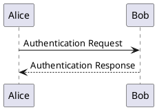
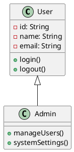
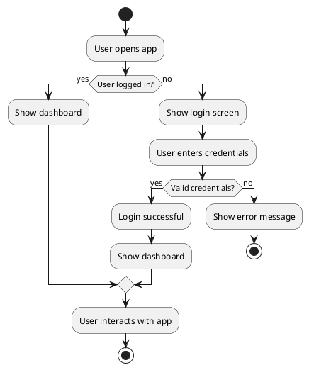
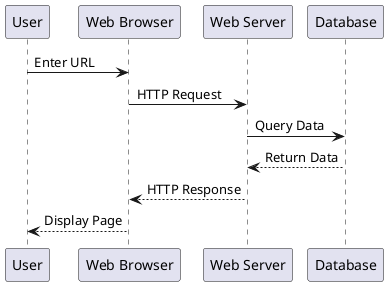

# Test Document with PlantUML Diagrams

This is a test document that contains both regular markdown content and PlantUML diagrams to verify the integration works correctly.

## Introduction

PlantUML is a powerful tool for creating UML diagrams from plain text descriptions. Let's test some basic diagrams.

## Simple Sequence Diagram

Here's a simple sequence diagram:



## Class Diagram

Testing a basic class diagram:



## Simple Activity Flow



## Very Simple Diagram

```puml
Bob->Alice : hello
```

## Mixed Content

This document shows that PlantUML diagrams work alongside regular markdown content like:

- **Bold text**
- *Italic text*
- `Code snippets`
- [Links](https://example.com)

### Code Block (Non-PlantUML)

```javascript
function greet(name) {
  return `Hello, ${name}!`;
}
```

### Another PlantUML Diagram



## Conclusion

This test file demonstrates that PlantUML diagrams are properly rendered within markdown documents alongside other content types.