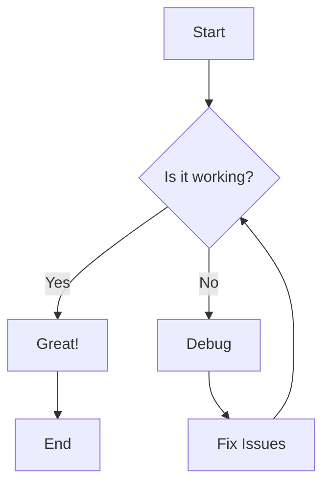
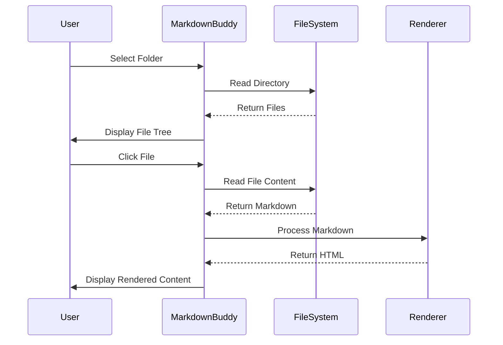
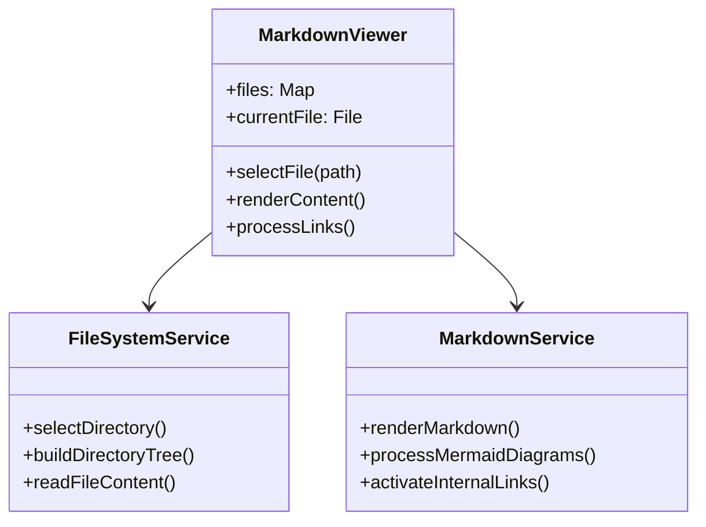
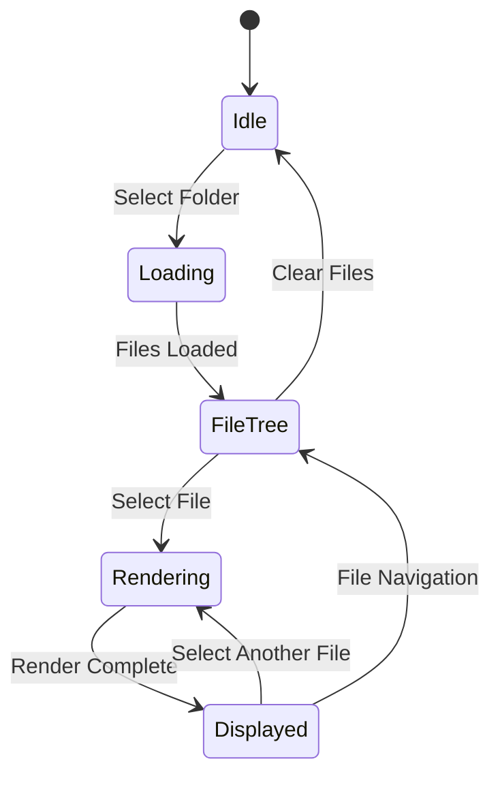
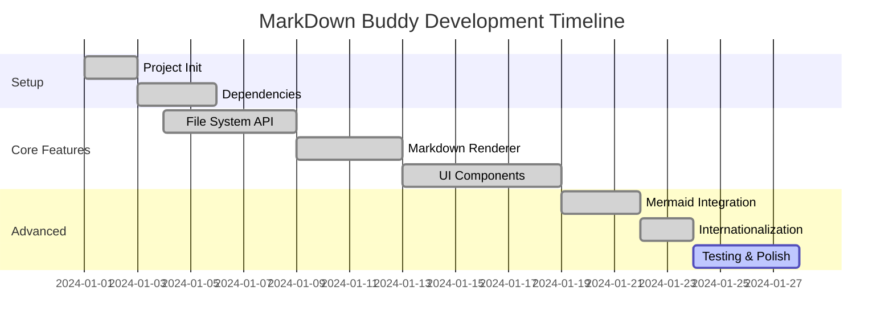
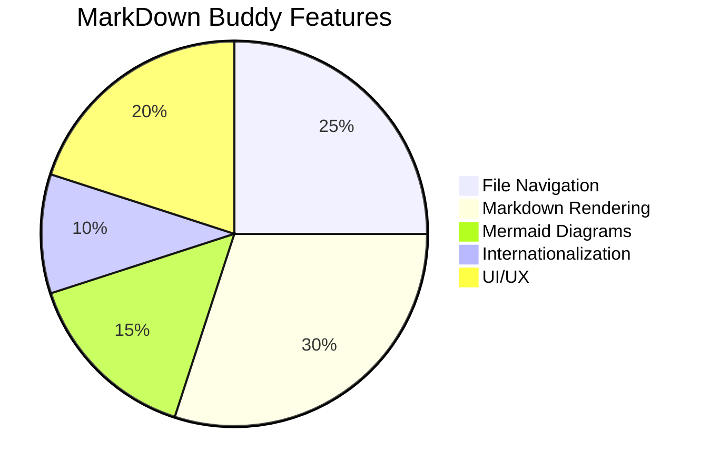
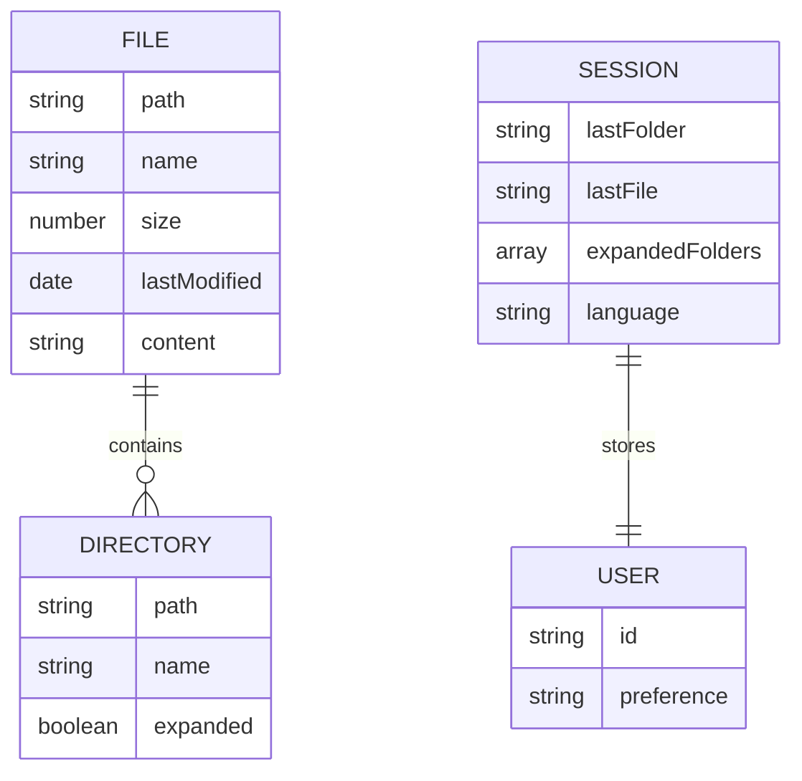

# Mermaid Diagram Examples

This document showcases various Mermaid diagrams supported by MarkDown Buddy.

## Flowchart Example



## Sequence Diagram



## Class Diagram



## State Diagram



## Gantt Chart



## Pie Chart



## Git Graph

```mermaid
gitgraph
    commit id: "Initial setup"
    commit id: "Add file system"
    branch feature-ui
    checkout feature-ui
    commit id: "Create components"
    commit id: "Add styling"
    checkout main
    merge feature-ui
    commit id: "Add Mermaid support"
    branch feature-i18n
    checkout feature-i18n
    commit id: "Add translations"
    checkout main
    merge feature-i18n
    commit id: "Release v1.0"
```

## ER Diagram



## Testing Instructions

1. **Scroll through each diagram** to verify proper rendering
2. **Check for errors** - broken diagrams show error messages
3. **Verify responsiveness** - diagrams should scale properly
4. **Test in both languages** - diagrams work in German and English

## Links to Other Examples

- [Code Examples](code-examples.md) - Syntax highlighting test
- [Complex Document](../docs/complex-example.md) - Full feature test
- [Internal Links](../docs/internal-links.md) - Navigation test

---

**Mermaid Version**: Latest supported by the application  
**Diagram Types**: All major Mermaid diagram types are supported!