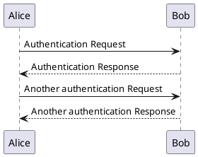
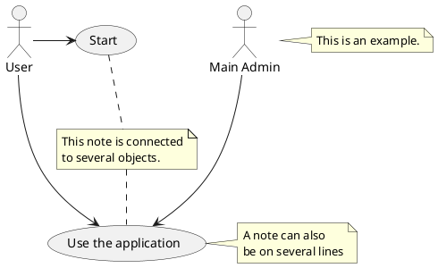
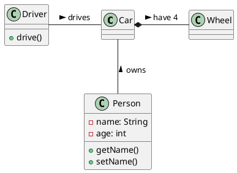
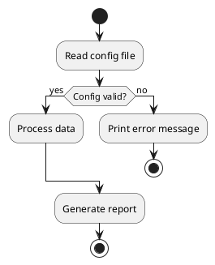
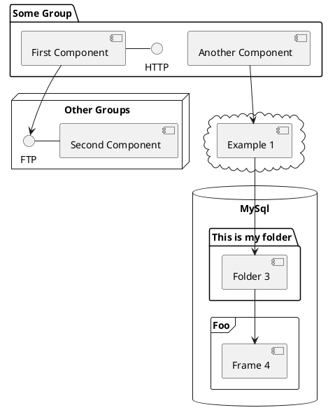
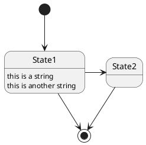
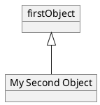
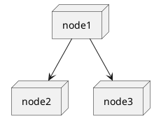

# PlantUML Diagram Examples

This document demonstrates various PlantUML diagram types supported by MarkDown Buddy.

## Sequence Diagram



## Use Case Diagram



## Class Diagram



## Activity Diagram



## Component Diagram



## State Diagram



## Object Diagram



## Deployment Diagram



## Simple Syntax Example

```plantuml
Bob->Alice : hello
```

This demonstrates that PlantUML diagrams are rendered inline alongside Mermaid diagrams and regular markdown content.