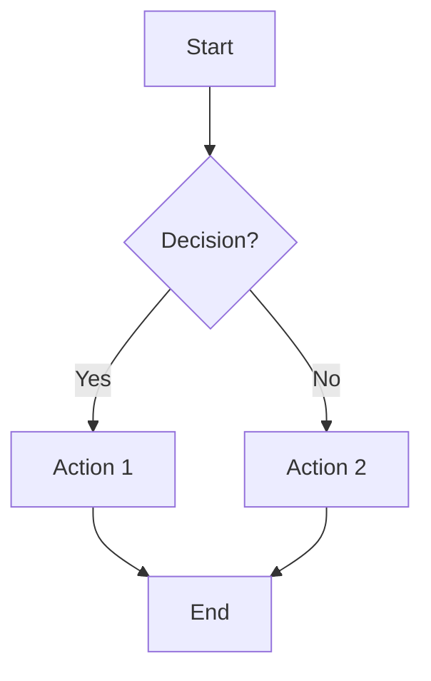
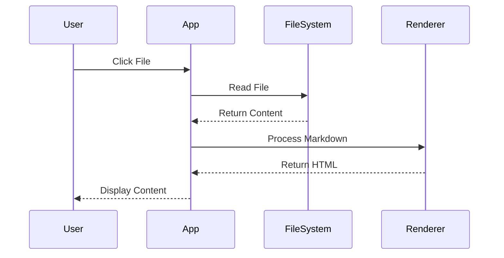
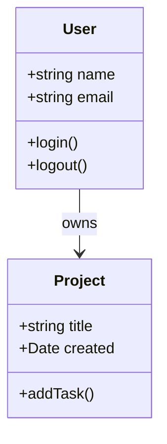

# User Guide - Complete Reference

This comprehensive guide covers all aspects of using MarkDown Buddy effectively.

## 📖 Table of Contents

1. [Getting Started](#getting-started)
2. [File Navigation](#file-navigation)
3. [Markdown Features](#markdown-features)
4. [Advanced Features](#advanced-features)
5. [Troubleshooting](#troubleshooting)
6. [Tips & Tricks](#tips--tricks)

## Getting Started

### First Launch
1. **Open MarkDown Buddy** in your web browser
2. **Select a folder** containing markdown files
3. **Explore the interface** - file tree on left, content on right
4. **Start reading** by clicking on files in the tree

### Interface Overview
```
┌─────────────────────────────────────────────────────────────┐
│ 📚 MarkDown Buddy    [📁] [🌐]                              │
├─────────────┬───────────────────────────────────────────────┤
│             │                                               │
│ File Tree   │           Content Panel                       │
│             │                                               │
│ 📁 docs     │  # Document Title                            │
│ ├─ file1.md │                                              │
│ ├─ file2.md │  Document content is rendered here with      │
│ └─ ...      │  full markdown support including:            │
│             │  - Headers and formatting                     │
│ 📁 guides   │  - Code syntax highlighting                  │
│ ├─ guide.md │  - Mermaid diagrams                          │
│ └─ ...      │  - Internal link navigation                  │
│             │                                               │
└─────────────┴───────────────────────────────────────────────┘
```

## File Navigation

### Using the File Tree

#### Expanding & Collapsing
- **Click folders** to expand/collapse them
- **Folder icons** change: 📁 (closed) → 📂 (open)
- **Use collapse button** (📂) to close all folders at once

#### File Selection  
- **Click any file** to view its content
- **Selected file** is highlighted in blue
- **File icons** show document type: 📄

#### Tree Controls
Located in the file tree header:
- **📂 Collapse All** - Close all expanded folders
- **💻 VS Code** - Open current file in VS Code editor

### Keyboard Navigation
*Coming in a future version:*
- `↑/↓` arrow keys to navigate files
- `Enter` to open selected file  
- `Space` to expand/collapse folders

## Markdown Features

### Basic Formatting

#### Headers
```markdown
# H1 Header - Main Title
## H2 Header - Section Title  
### H3 Header - Subsection
#### H4 Header - Sub-subsection
##### H5 Header - Minor heading
###### H6 Header - Smallest heading
```

#### Text Formatting
```markdown
**Bold text** or __also bold__
*Italic text* or _also italic_  
***Bold and italic***
~~Strikethrough text~~
`Inline code`
```

#### Lists
```markdown
Unordered lists:
- Item 1
- Item 2  
  - Nested item
  - Another nested item

Ordered lists:
1. First item
2. Second item
   1. Nested numbered item
   2. Another nested item

Task lists:
- [x] Completed task
- [ ] Incomplete task
```

### Advanced Formatting

#### Tables
```markdown
| Column 1 | Column 2 | Column 3 |
|----------|----------|----------|
| Data 1   | Data 2   | Data 3   |
| More     | Data     | Here     |

With alignment:
| Left | Center | Right |
|:-----|:------:|------:|
| Text | Text   | Text  |
```

#### Code Blocks
```markdown
```javascript
function example() {
  console.log("Syntax highlighting works!");
}
```
```

#### Blockquotes
```markdown
> This is a blockquote
> It can span multiple lines
> 
> And contain other markdown elements
```

#### Links
```markdown
[External link](https://example.com)
[Internal link](other-file.md)
[Link with title](https://example.com "Hover text")
```

### Supported Languages for Syntax Highlighting

MarkDown Buddy supports syntax highlighting for these languages:

**Web Technologies:**
- HTML, CSS, SCSS, Less
- JavaScript, TypeScript
- React JSX, Vue
- JSON, XML, YAML

**Programming Languages:**
- Python, Java, C++, C#
- Go, Rust, Swift, Kotlin  
- PHP, Ruby, Perl
- Shell/Bash scripts

**Data & Config:**
- SQL, PostgreSQL, MySQL
- Docker, Nginx
- Markdown, LaTeX
- And many more...

## Advanced Features

### Mermaid Diagrams

MarkDown Buddy automatically renders Mermaid diagrams:

#### Flowcharts


#### Sequence Diagrams


#### Class Diagrams


### Internal Link Navigation

#### How It Works
1. **Click internal links** (ending in `.md` or `.markdown`)
2. **App resolves path** relative to current file
3. **Target file loads** automatically
4. **File tree updates** to show new selection

#### Link Resolution Order
1. **Exact path match** from current directory
2. **Relative path resolution** (../folder/file.md)
3. **Filename search** across all directories
4. **Add .md extension** if missing

#### Navigation Examples
From `/docs/getting-started.md`:
```markdown
[Same folder](user-guide.md)
[Parent folder](../README.md)
[Subfolder](../projects/project-a/overview.md)
[Root relative](/guides/installation.md)
```

### Language & Internationalization

#### Switching Languages
1. **Click language icon** (🌐) in header
2. **Select German or English**
3. **Interface updates immediately**

#### What Gets Translated
- **Menu items** and buttons
- **Error messages** and alerts
- **File statistics** labels
- **Tooltip text** and help

#### Persistent Settings
Your language preference is:
- **Automatically saved** to localStorage
- **Restored** on next visit
- **Synced** across browser tabs

### Session Management

#### Automatic Saving
MarkDown Buddy remembers:
- ✅ **Last opened folder**
- ✅ **Currently selected file**  
- ✅ **Expanded folder states**
- ✅ **Language preference**

#### Session Restoration
On startup, you'll be prompted to:
- **Restore previous session** (recommended)
- **Start fresh** with folder selection

#### Clearing Session
To reset saved data:
1. Clear browser localStorage
2. Or select a new folder to override

## Troubleshooting

### Common Issues

#### "No markdown files found"
**Cause**: Selected folder contains no .md or .markdown files
**Solution**: 
- Choose a different folder
- Check if files have correct extensions
- Look in subfolders

#### Files don't load after selection
**Cause**: Browser security restrictions
**Solution**:
- Reload the page
- Try selecting the folder again  
- Check browser console for errors

#### Internal links show "File not found"
**Cause**: Target file doesn't exist or path is incorrect
**Solutions**:
- Verify file exists in selected directory
- Check relative path syntax
- Ensure file has .md or .markdown extension
- Try absolute path from root

#### Mermaid diagrams don't render
**Causes & Solutions**:
- **Syntax error**: Check mermaid syntax documentation
- **Browser compatibility**: Try a modern browser
- **Large diagrams**: Simplify complex diagrams
- **Check console**: Look for JavaScript errors

#### Language doesn't change  
**Solutions**:
- Refresh the page
- Clear browser cache
- Check if browser supports localStorage

#### VS Code doesn't open
**Requirements**:
- VS Code must be installed
- Browser must support vscode:// protocol  
- Some browsers require user permission

### Performance Issues

#### Large directories load slowly
**Expected behavior**: The app processes all markdown files
**Improvements**:
- Use folders with fewer files for testing
- App automatically ignores common build folders

#### Rendering is slow on large files
**Solutions**:
- Break large files into smaller documents
- Use internal links to connect related content
- Consider file organization

### Browser Compatibility

#### Recommended Browsers
- **Chrome** 88+ (full features)
- **Firefox** 85+ (full features)  
- **Safari** 14+ (full features)
- **Edge** 88+ (full features)

#### Feature Support
| Feature | Chrome | Firefox | Safari | Edge |
|---------|--------|---------|--------|------|
| File System API | ✅ | ⚠️ | ⚠️ | ✅ |
| Directory Picker | ✅ | ❌ | ❌ | ✅ |
| Syntax Highlighting | ✅ | ✅ | ✅ | ✅ |
| Mermaid Diagrams | ✅ | ✅ | ✅ | ✅ |
| VS Code Links | ✅ | ✅ | ✅ | ✅ |

⚠️ = Limited support, fallback available  
❌ = Uses fallback implementation

## Tips & Tricks

### Organization Best Practices

#### Folder Structure
```
project/
├── README.md           # Project overview (start here)
├── docs/              # Detailed documentation
│   ├── getting-started.md
│   ├── api-reference.md
│   └── troubleshooting.md
├── tutorials/         # Step-by-step guides  
│   ├── basic-usage.md
│   └── advanced-features.md
├── examples/          # Code samples
│   └── code-examples.md
└── guides/            # User guides
    └── user-manual.md
```

#### Naming Conventions
- **Use kebab-case** for filenames: `user-guide.md`
- **Keep names descriptive** but concise
- **Number files** for ordered content: `01-introduction.md`
- **Use prefixes** for categories: `api-users.md`, `api-projects.md`

### Writing Effective Links

#### Internal Links
```markdown
✅ Good:
[User Guide](../guides/user-guide.md)
[API Reference](./api-reference.md)

❌ Avoid:
[Click here](../guides/user-guide.md)  
[Link](./api-reference.md)
```

#### Link Organization
- **Create index pages** linking to subsections
- **Use relative paths** when possible
- **Test all links** by clicking them
- **Add descriptions** for external links

### Content Creation Tips

#### Headers
- **Use H1** for document title (one per file)
- **Use H2-H6** for sections and subsections  
- **Keep hierarchy logical** (don't skip levels)

#### Code Examples
- **Always specify language** for syntax highlighting
- **Keep examples concise** but complete
- **Add comments** to explain complex code
- **Test code examples** before publishing

#### Diagrams
- **Start simple** and add complexity gradually
- **Use consistent styling** across diagrams
- **Add titles** to complex diagrams  
- **Test rendering** in MarkDown Buddy

### Keyboard Efficiency

#### Browser Shortcuts
- **Ctrl/Cmd + R** - Reload page
- **Ctrl/Cmd + F** - Search in current document
- **Alt + ←/→** - Navigate browser history
- **F11** - Toggle fullscreen mode

#### Navigation Tips
- **Use bookmarks** for frequently accessed documents
- **Open multiple tabs** for cross-reference
- **Use browser history** for navigation
- **Bookmark folder paths** for quick access

## Related Documentation

### Internal Guides
- [Installation Guide](installation.md) - Setup instructions
- [Getting Started](../docs/getting-started.md) - Quick start
- [Advanced Tutorial](../tutorials/advanced-tutorial.md) - Power user features

### Example Content
- [Complex Example](../docs/complex-example.md) - Full feature showcase
- [Code Examples](../examples/code-examples.md) - Syntax highlighting
- [Mermaid Examples](../examples/mermaid-examples.md) - Diagram samples

### Project Documentation
- [Project Alpha](../projects/project-a/overview.md) - Web application
- [Project Beta](../projects/project-b/overview.md) - Mobile application

---

**User Guide Complete!** 📚

You now have comprehensive knowledge of MarkDown Buddy. For additional help:

- **Browse examples** in this test collection
- **Try different features** hands-on
- **Experiment** with your own markdown files

**Happy documenting!** 🚀

[← Back to Main](../README.md) | [Installation Guide →](installation.md)