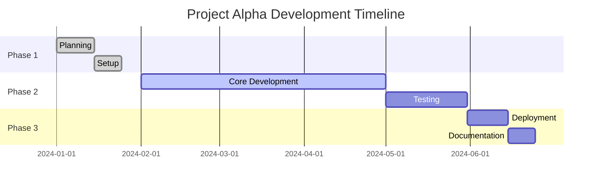
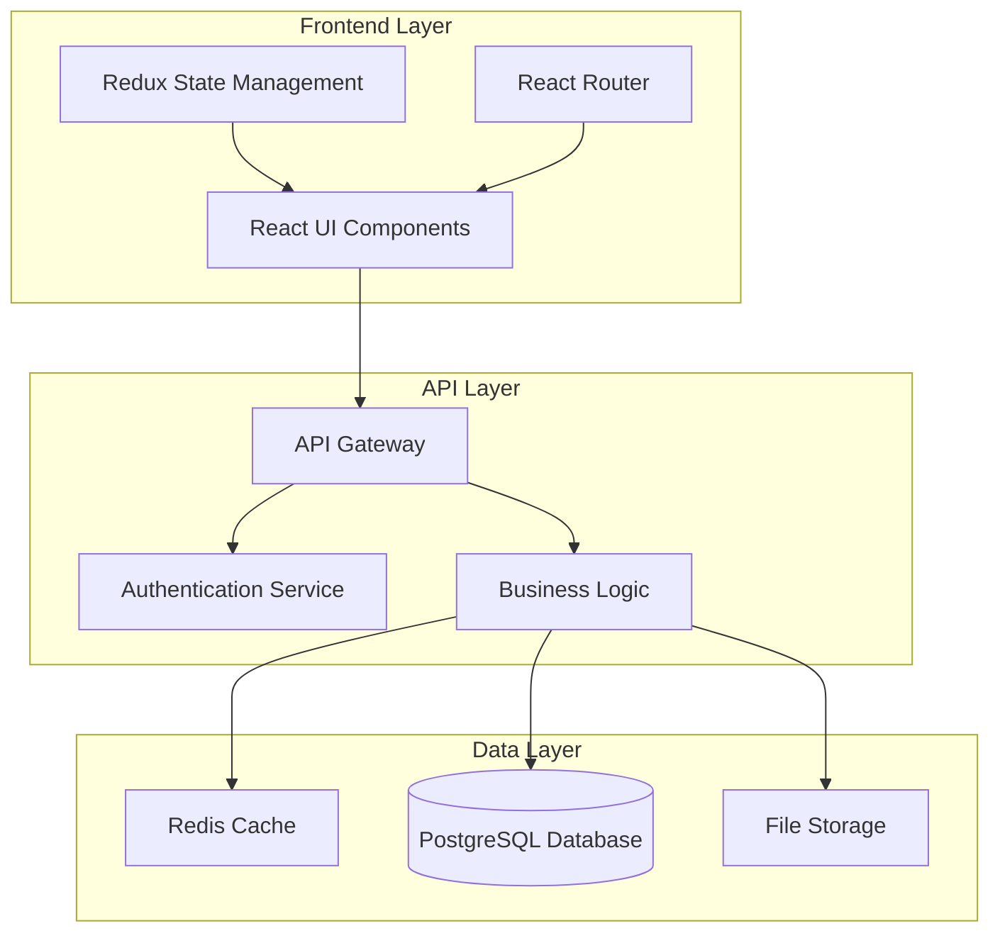

# Project Alpha - Overview

**Project Alpha** is a demonstration project for testing MarkDown Buddy's project documentation features.

## 📋 Project Details

- **Name**: Project Alpha
- **Version**: 1.0.0
- **Status**: Active Development
- **Team Size**: 3 developers
- **Timeline**: 6 months

## 🎯 Objectives

1. **Primary Goal**: Create a scalable web application
2. **Secondary Goal**: Implement modern development practices
3. **Learning Goal**: Master React and TypeScript

## 📁 Documentation Structure

- [Overview](overview.md) - This document
- [Details](details.md) - Technical specifications
- [Setup](../project-b/setup.md) - Development environment
- [API Reference](../../guides/user-guide.md) - External API docs

## 🛠️ Technology Stack

### Frontend
- **React 18** - UI library
- **TypeScript** - Type safety
- **Material-UI** - Component library
- **Vite** - Build tool

### Backend
- **Node.js** - Runtime environment
- **Express.js** - Web framework
- **PostgreSQL** - Database
- **Redis** - Caching

### DevOps
- **Docker** - Containerization
- **GitHub Actions** - CI/CD
- **AWS** - Cloud hosting
- **Terraform** - Infrastructure as Code

## 📊 Project Status

## 🏗️ Architecture Overview

## 🎨 Design System

### Color Palette
- **Primary**: #2c3e50 (Dark Blue)
- **Secondary**: #3498db (Light Blue)
- **Success**: #27ae60 (Green)
- **Warning**: #f39c12 (Orange)
- **Danger**: #e74c3c (Red)

### Typography
- **Headings**: Roboto Bold
- **Body Text**: Roboto Regular
- **Code**: Roboto Mono

### Component Library
All components follow Material Design principles with custom theming.

## 🧪 Testing Strategy

### Unit Tests
- **Jest** for testing framework
- **React Testing Library** for component tests
- **Coverage Target**: 90%+

### Integration Tests
- **Cypress** for E2E testing
- **API testing** with Postman/Newman
- **Database integration** tests

### Performance Tests
- **Lighthouse** audits
- **Load testing** with Artillery
- **Bundle analysis** with webpack-bundle-analyzer

## 📈 Metrics & Monitoring

### Key Performance Indicators
- **Page Load Time** < 2 seconds
- **First Contentful Paint** < 1 second
- **Time to Interactive** < 3 seconds
- **Uptime** > 99.9%

### Monitoring Tools
- **Application**: New Relic
- **Infrastructure**: DataDog
- **Error Tracking**: Sentry
- **Analytics**: Google Analytics

## 🔗 Related Documents

### Internal Links
- [Technical Details](details.md)
- [Project B Comparison](../project-b/overview.md)
- [Setup Instructions](../project-b/setup.md)

### External References
- [React Documentation](https://react.dev)
- [TypeScript Handbook](https://www.typescriptlang.org/docs/)
- [Material-UI Documentation](https://mui.com)

## 👥 Team

### Development Team
- **Alice Johnson** - Lead Developer
- **Bob Smith** - Frontend Developer  
- **Carol Davis** - Backend Developer

### Stakeholders
- **David Wilson** - Product Manager
- **Eve Brown** - UI/UX Designer
- **Frank Miller** - DevOps Engineer

## 📞 Contact

- **Project Lead**: alice@company.com
- **Slack Channel**: #project-alpha
- **Issue Tracker**: GitHub Issues
- **Documentation**: This MarkDown Buddy collection

---

**Last Updated**: December 2024  
**Next Review**: January 2025

[← Back to Projects](../../README.md) | [Technical Details →](details.md)