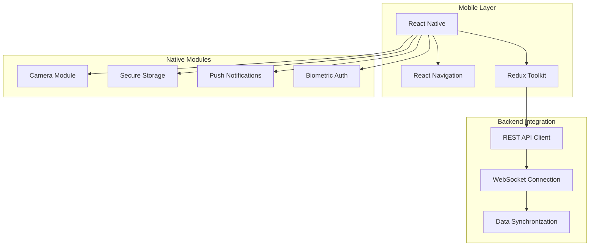
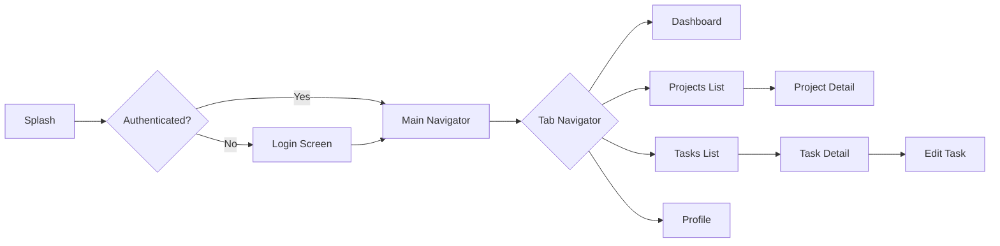
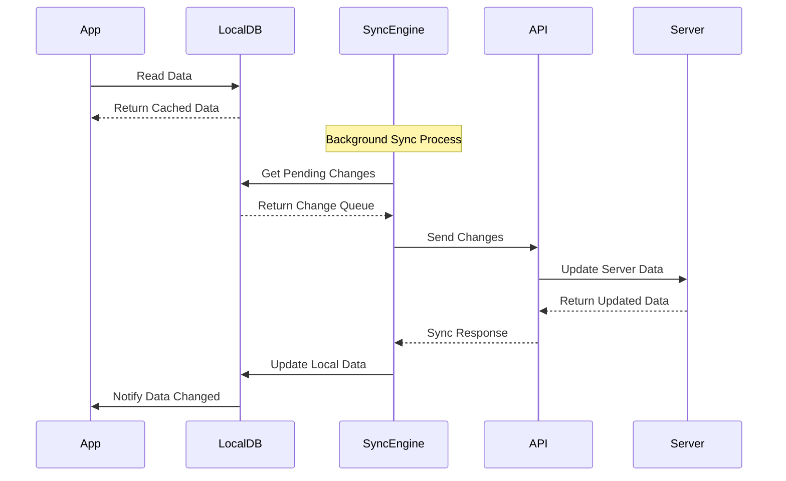

# Project Beta - Mobile Application

**Project Beta** is a companion mobile application that demonstrates cross-platform documentation linking.

## 📱 Project Summary

- **Platform**: React Native
- **Target**: iOS & Android
- **Status**: Planning Phase
- **Expected Launch**: Q2 2025
- **Team Size**: 2 mobile developers

## 🎯 Project Goals

### Primary Objectives
1. **Mobile Companion** to Project Alpha
2. **Offline Capabilities** for field work
3. **Real-time Synchronization** with web app
4. **Native Performance** on both platforms

### Success Metrics
- **App Store Rating** > 4.5 stars
- **Download Target** 10,000+ in first month
- **User Retention** > 70% after 30 days
- **Crash Rate** < 0.1%

## 🛠️ Technology Stack



### Core Dependencies
```json
{
  "react-native": "^0.72.0",
  "react-navigation": "^6.0.0",
  "@reduxjs/toolkit": "^1.9.0",
  "react-native-reanimated": "^3.0.0",
  "react-native-gesture-handler": "^2.0.0",
  "react-native-vector-icons": "^10.0.0",
  "@react-native-async-storage/async-storage": "^1.19.0",
  "react-native-keychain": "^8.0.0",
  "react-native-camera": "^4.2.0"
}
```

## 📋 Feature Specification

### Core Features
- [ ] **User Authentication** with biometric support
- [ ] **Project Dashboard** with real-time updates
- [ ] **Task Management** with offline editing
- [ ] **File Upload** with camera integration
- [ ] **Push Notifications** for important updates
- [ ] **Offline Mode** with automatic sync

### Advanced Features
- [ ] **Voice Notes** for task comments
- [ ] **GPS Tracking** for location-based tasks
- [ ] **Team Chat** with real-time messaging
- [ ] **Document Scanner** using device camera
- [ ] **Time Tracking** with automatic detection
- [ ] **Dark Mode** with system preference sync

## 📐 UI/UX Design

### Design System
Following Material Design 3.0 principles:

- **Primary Color**: #1976D2 (Blue 700)
- **Secondary Color**: #DC004E (Pink A400)
- **Surface Colors**: Dynamic based on system theme
- **Typography**: Roboto font family
- **Icons**: Material Icons with custom project icons

### Screen Architecture


### Responsive Design
```javascript
// Responsive breakpoints for tablets
const breakpoints = {
  phone: 0,
  tablet: 768,
  desktop: 1024
};

// Adaptive layouts
const useResponsiveLayout = () => {
  const screenWidth = useWindowDimensions().width;
  
  return {
    isPhone: screenWidth < breakpoints.tablet,
    isTablet: screenWidth >= breakpoints.tablet && screenWidth < breakpoints.desktop,
    columns: screenWidth < breakpoints.tablet ? 1 : 2,
    showSidebar: screenWidth >= breakpoints.tablet
  };
};
```

## 🔄 Data Synchronization

### Sync Strategy


### Conflict Resolution
```javascript
const resolveConflict = (localItem, serverItem) => {
  // Server wins for critical fields
  const criticalFields = ['status', 'assignee', 'due_date'];
  
  // Client wins for user-specific fields
  const clientFields = ['notes', 'attachments', 'time_spent'];
  
  // Merge strategy
  const resolved = {
    ...localItem,
    ...serverItem,
    // Keep client changes for user fields
    ...pick(localItem, clientFields),
    // Server timestamp always wins
    updated_at: serverItem.updated_at,
    // Mark as synced
    sync_status: 'synced'
  };
  
  return resolved;
};
```

## 🔒 Security & Privacy

### Data Protection
- **End-to-End Encryption** for sensitive data
- **Biometric Authentication** (Face ID/Touch ID/Fingerprint)
- **Secure Storage** using iOS Keychain / Android Keystore
- **Certificate Pinning** for API communications
- **Data Anonymization** for analytics

### Privacy Compliance
- **GDPR Compliant** data handling
- **CCPA Compliance** for California users
- **Minimal Data Collection** principle
- **User Consent Management** for tracking
- **Right to Deletion** implementation

## 🧪 Testing Strategy

### Unit Testing
```javascript
// Example test structure
describe('TaskService', () => {
  describe('syncTasks', () => {
    it('should merge local and server changes correctly', async () => {
      const localTasks = [{ id: '1', title: 'Local Task', notes: 'User notes' }];
      const serverTasks = [{ id: '1', title: 'Server Task', status: 'completed' }];
      
      const result = await TaskService.syncTasks(localTasks, serverTasks);
      
      expect(result[0]).toEqual({
        id: '1',
        title: 'Server Task',
        notes: 'User notes',
        status: 'completed'
      });
    });
  });
});
```

### Integration Testing
- **E2E Testing** with Detox
- **API Integration** tests
- **Offline Scenario** testing
- **Performance Testing** on different devices
- **Accessibility Testing** with screen readers

### Device Testing Matrix
| Device | iOS Version | Android Version | Testing Focus |
|--------|-------------|-----------------|---------------|
| iPhone 12 | 15.0+ | - | Core functionality |
| iPhone SE | 14.0+ | - | Small screen support |
| iPad Pro | 15.0+ | - | Tablet layout |
| Pixel 6 | - | 12.0+ | Android specific features |
| Samsung S21 | - | 11.0+ | Performance testing |

## 📈 Performance Optimization

### App Performance
- **Image Optimization** with WebP format
- **List Virtualization** for large datasets
- **Bundle Splitting** for faster startup
- **Memory Management** for smooth scrolling
- **Background Task Optimization**

### Metrics to Monitor
```javascript
const performanceMetrics = {
  // App startup time
  coldStart: '< 3 seconds',
  warmStart: '< 1 second',
  
  // User interaction
  buttonPress: '< 100ms response',
  screenTransition: '< 300ms',
  
  // Data loading
  initialDataLoad: '< 2 seconds',
  backgroundSync: '< 30 seconds',
  
  // Memory usage
  memoryFootprint: '< 100MB baseline',
  memoryLeaks: '0 detected'
};
```

## 🚀 Deployment Pipeline

### Build Configuration
```yaml
# GitHub Actions for mobile deployment
name: Build and Deploy Mobile App

on:
  push:
    branches: [main, develop]
    tags: ['v*']

jobs:
  ios-build:
    runs-on: macos-latest
    steps:
      - uses: actions/checkout@v3
      - uses: actions/setup-node@v3
        with:
          node-version: '18'
          cache: 'npm'
          
      - name: Install dependencies
        run: npm ci
        
      - name: Install CocoaPods
        run: cd ios && pod install
        
      - name: Build iOS
        run: npm run build:ios
        
      - name: Upload to TestFlight
        if: startsWith(github.ref, 'refs/tags/')
        run: npm run deploy:ios

  android-build:
    runs-on: ubuntu-latest
    steps:
      - uses: actions/checkout@v3
      - uses: actions/setup-node@v3
        with:
          node-version: '18'
          cache: 'npm'
          
      - uses: actions/setup-java@v3
        with:
          distribution: 'temurin'
          java-version: '11'
          
      - name: Install dependencies
        run: npm ci
        
      - name: Build Android
        run: npm run build:android
        
      - name: Upload to Play Console
        if: startsWith(github.ref, 'refs/tags/')
        run: npm run deploy:android
```

## 🔗 Integration with Project Alpha

### Shared Components
Both projects share:
- **API Endpoints** and data models
- **Authentication System** and user management
- **Business Logic** and validation rules
- **Design System** and UI components

### Cross-Platform Links
- [Project Alpha Overview](../project-a/overview.md)
- [Technical Details](../project-a/details.md)
- [Setup Instructions](setup.md)

### Data Synchronization
Real-time sync ensures:
- **Consistent State** between web and mobile
- **Offline Capabilities** with conflict resolution
- **Push Notifications** for important updates
- **Seamless User Experience** across platforms

---

**Project Status**: Planning Phase  
**Development Start**: January 2025  
**Beta Release**: March 2025  
**Production Release**: Q2 2025

[Next: Setup Instructions →](setup.md) | [← Back to Projects](../../README.md)