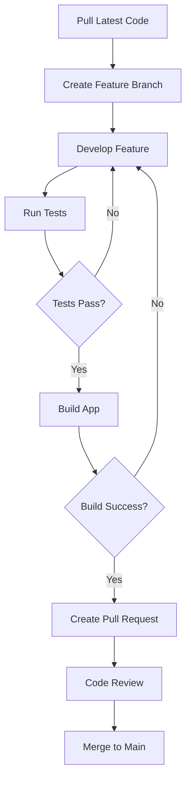

# Project Beta - Development Setup

This guide walks you through setting up the development environment for Project Beta mobile application.

## 🔧 Prerequisites

### Required Software
- **Node.js** 18.0.0 or higher
- **npm** 8.0.0 or higher  
- **Git** 2.30.0 or higher
- **Java Development Kit** 11 (for Android)
- **Android Studio** (for Android development)
- **Xcode** 14+ (for iOS development, macOS only)
- **CocoaPods** (for iOS dependencies)

### System Requirements

#### For iOS Development (macOS only)
- **macOS** 12.0 (Monterey) or higher
- **Xcode** 14.0 or higher
- **iOS Simulator** (included with Xcode)
- **CocoaPods** 1.11.0 or higher

#### For Android Development (All platforms)
- **Android Studio** Flamingo or higher
- **Android SDK** API level 31 or higher
- **Android Emulator** or physical device
- **Java JDK** 11 (OpenJDK recommended)

## 📱 Environment Setup

### 1. React Native Development Environment

#### Install React Native CLI
```bash
npm install -g @react-native-community/cli
```

#### Verify Installation
```bash
npx react-native doctor
```

This command checks your development environment and suggests fixes for common issues.

### 2. Android Development Setup

#### Install Android Studio
1. Download from [Android Studio website](https://developer.android.com/studio)
2. Follow installation wizard
3. Install Android SDK, SDK Platform-Tools, and Build-Tools

#### Configure Android SDK
```bash
# Add to your ~/.bashrc or ~/.zshrc
export ANDROID_HOME=$HOME/Library/Android/sdk  # macOS
export ANDROID_HOME=$HOME/Android/Sdk          # Linux
export PATH=$PATH:$ANDROID_HOME/emulator
export PATH=$PATH:$ANDROID_HOME/platform-tools
```

#### Create Virtual Device
```bash
# List available AVDs
emulator -list-avds

# Create new AVD (if none exist)
android create avd --target android-31 --name ProjectBeta_AVD
```

### 3. iOS Development Setup (macOS only)

#### Install Xcode
1. Download from Mac App Store
2. Launch Xcode and install additional components
3. Agree to license terms

#### Install CocoaPods
```bash
sudo gem install cocoapods
pod setup
```

#### iOS Simulator
```bash
# List available simulators
xcrun simctl list devices

# Boot a specific simulator
xcrun simctl boot "iPhone 14"
```

## 🚀 Project Setup

### 1. Clone Repository
```bash
git clone https://github.com/company/project-beta-mobile.git
cd project-beta-mobile
```

### 2. Install Dependencies
```bash
# Install Node.js dependencies
npm install

# Install iOS dependencies (macOS only)
cd ios && pod install && cd ..
```

### 3. Environment Configuration

#### Create Environment Files
```bash
# Development environment
cp .env.example .env.development

# Staging environment  
cp .env.example .env.staging

# Production environment
cp .env.example .env.production
```

#### Configure Environment Variables
```bash
# .env.development
API_BASE_URL=https://api-dev.projectalpha.com
API_TIMEOUT=10000
SENTRY_DSN=https://your-sentry-dsn@sentry.io/project
GOOGLE_ANALYTICS_ID=G-XXXXXXXXXX
CODEPUSH_KEY_ANDROID=your-codepush-key
CODEPUSH_KEY_IOS=your-codepush-key
```

### 4. Start Metro Bundler
```bash
# Start Metro bundler (keep this running)
npx react-native start

# Or with cache reset
npx react-native start --reset-cache
```

### 5. Run on Devices

#### Android
```bash
# Run on Android emulator or device
npx react-native run-android

# Run on specific device
npx react-native run-android --deviceId=DEVICE_ID

# Build release version
npx react-native run-android --variant=release
```

#### iOS (macOS only)
```bash
# Run on iOS simulator
npx react-native run-ios

# Run on specific simulator
npx react-native run-ios --simulator="iPhone 14"

# Run on physical device
npx react-native run-ios --device="Your iPhone"
```

## 🔧 Development Tools

### 1. Debugging Tools

#### Flipper Integration
```bash
# Install Flipper
brew install --cask flipper

# Start Flipper and connect your app
# Flipper provides network debugging, Redux inspector, and more
```

#### React Native Debugger
```bash
# Install React Native Debugger
brew install --cask react-native-debugger

# Enable remote debugging in your app
# Shake device -> Debug -> Enable Remote Debugging
```

### 2. Code Quality Tools

#### ESLint & Prettier
```bash
# Lint code
npm run lint

# Fix linting issues automatically
npm run lint:fix

# Format code with Prettier
npm run format
```

#### TypeScript
```bash
# Type checking
npm run type-check

# Type checking in watch mode
npm run type-check:watch
```

### 3. Testing Setup

#### Run Tests
```bash
# Run unit tests
npm test

# Run tests in watch mode
npm run test:watch

# Run tests with coverage
npm run test:coverage

# Run E2E tests (requires device/emulator)
npm run e2e:android
npm run e2e:ios
```

#### Test Configuration
```javascript
// jest.config.js
module.exports = {
  preset: 'react-native',
  setupFilesAfterEnv: ['<rootDir>/jest.setup.js'],
  testMatch: [
    '**/__tests__/**/*.(ts|tsx|js)',
    '**/*.(test|spec).(ts|tsx|js)'
  ],
  collectCoverageFrom: [
    'src/**/*.{ts,tsx}',
    '!src/**/*.d.ts',
    '!src/**/index.ts'
  ],
  coverageThreshold: {
    global: {
      branches: 80,
      functions: 80,
      lines: 80,
      statements: 80
    }
  }
};
```

## 🔄 Build and Deployment

### 1. Android Build

#### Debug Build
```bash
cd android
./gradlew assembleDebug
```

#### Release Build
```bash
cd android

# Generate upload keystore (first time only)
keytool -genkey -v -keystore upload-keystore.keystore -alias upload -keyalg RSA -keysize 2048 -validity 10000

# Build release APK
./gradlew assembleRelease

# Build release Bundle (recommended for Play Store)
./gradlew bundleRelease
```

### 2. iOS Build

#### Debug Build
```bash
# Build for simulator
npx react-native run-ios --configuration Debug

# Build for device  
npx react-native run-ios --device --configuration Debug
```

#### Release Build
```bash
# Build for App Store
xcodebuild -workspace ios/ProjectBeta.xcworkspace \
  -scheme ProjectBeta \
  -configuration Release \
  -destination generic/platform=iOS \
  -archivePath ios/build/ProjectBeta.xcarchive \
  archive

# Export IPA
xcodebuild -exportArchive \
  -archivePath ios/build/ProjectBeta.xcarchive \
  -exportPath ios/build \
  -exportOptionsPlist ios/ExportOptions.plist
```

## 🛠️ Troubleshooting

### Common Issues

#### Metro Bundler Issues
```bash
# Clear Metro cache
npx react-native start --reset-cache

# Clear node_modules and reinstall
rm -rf node_modules && npm install

# Clear watchman cache (macOS/Linux)
watchman watch-del-all
```

#### Android Build Issues
```bash
# Clean Android build
cd android && ./gradlew clean && cd ..

# Reset Android build
cd android && ./gradlew cleanBuildCache && cd ..

# Check Android setup
npx react-native doctor
```

#### iOS Build Issues
```bash
# Clean iOS build
cd ios && xcodebuild clean && cd ..

# Clean derived data
rm -rf ~/Library/Developer/Xcode/DerivedData

# Reinstall CocoaPods
cd ios && pod deintegrate && pod install && cd ..
```

#### Permission Issues (Android)
Add to `android/app/src/main/AndroidManifest.xml`:
```xml
<uses-permission android:name="android.permission.INTERNET" />
<uses-permission android:name="android.permission.CAMERA" />
<uses-permission android:name="android.permission.WRITE_EXTERNAL_STORAGE" />
<uses-permission android:name="android.permission.READ_EXTERNAL_STORAGE" />
<uses-permission android:name="android.permission.ACCESS_FINE_LOCATION" />
```

## 📚 Additional Resources

### Documentation Links
- [React Native Documentation](https://reactnative.dev/docs/getting-started)
- [Android Developer Guide](https://developer.android.com/guide)
- [iOS Developer Guide](https://developer.apple.com/documentation/)
- [Project Alpha API Docs](../project-a/details.md)

### Development Guides
- [React Native Performance](https://reactnative.dev/docs/performance)
- [Debugging Guide](https://reactnative.dev/docs/debugging)
- [Testing Guide](https://reactnative.dev/docs/testing-overview)

### Internal Links
- [Project Overview](overview.md)
- [Project Alpha Details](../project-a/details.md)
- [User Guide](../../guides/user-guide.md)

## 🎯 Next Steps

After completing the setup:

1. **Explore the codebase** structure and conventions
2. **Run the test suite** to ensure everything works
3. **Try building** for both platforms
4. **Set up your IDE** with React Native extensions
5. **Join the team Slack** for development discussions

### Development Workflow


---

**Setup Complete!** 🎉 You're ready to start developing Project Beta.

**Need Help?** Contact the team:
- **Slack**: #project-beta-dev
- **Email**: dev-team@company.com

[← Project Overview](overview.md) | [Back to Projects](../../README.md)