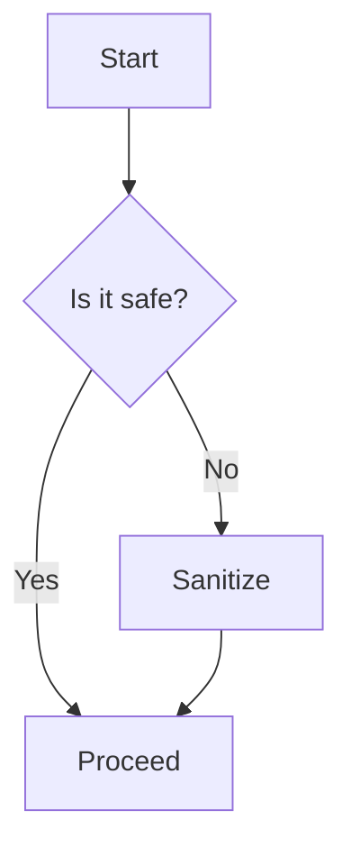

# Security Test Document

This document tests the DOMPurify XSS protection implementation.

## Safe Content
This should render normally:
- **Bold text**
- *Italic text*
- `Code blocks`

## Previously Dangerous Content (Now Sanitized)

The following would have been dangerous before DOMPurify:

```html
<script>alert('This should NOT execute!')</script>
```

<script>console.log('This script should be sanitized out')</script>

<p>This paragraph should remain</p>


## SVG Content (Should Be Preserved)

<svg viewBox="0 0 100 50" xmlns="http://www.w3.org/2000/svg">
  <rect x="10" y="10" width="30" height="30" fill="blue" />
  <circle cx="70" cy="25" r="15" fill="red" />
  <text x="5" y="45" font-size="8">SVG Test</text>
</svg>

## Mermaid Diagram (Should Work)



If you can see this content without any JavaScript alerts or console errors, the DOMPurify implementation is working correctly!