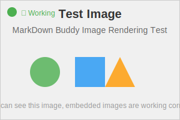

# Simple Image Test

Testing different image reference formats:

## Test 1: Same directory with ./

## Test 2: Same directory without ./

## Test 3: HTML img tag

## Test 4: HTML img tag without ./

If any of these images display correctly, then image rendering is working!