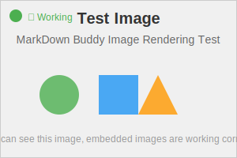

# Test Document with Embedded Image

This is a test markdown file to verify that embedded images work correctly in the MarkDown Buddy application.

## Sample Image

Below is an embedded image using relative path syntax:

## Alternative Image Syntax

You can also use HTML img tags:

## Different Path Formats

The system should handle various relative path formats:

- Same directory: ``
- Subdirectory: ``
- Parent directory: ``

## Features Demonstrated

✅ **Image Loading**: Images are converted to blob URLs for browser access  
✅ **Path Resolution**: Relative paths are automatically resolved  
✅ **Security**: Images go through DOMPurify sanitization  
✅ **Performance**: Efficient blob URL management  

## Instructions for Testing

1. Create a test directory with this markdown file
2. Add an image file named `test-image.svg` in the same directory
3. Open the directory in MarkDown Buddy
4. Select this markdown file
5. Verify that the image renders correctly

## Expected Results

- The image should display properly in both markdown and HTML syntax
- File tree should show only markdown files (`.md` files are clickable)
- Image files are loaded in the background but not shown in the tree
- Images should be accessible even when referenced with relative paths
- No broken image icons or 404 errors should appear