# Advanced Tutorial: MarkDown Buddy Pro Features

This tutorial covers the advanced features of MarkDown Buddy for power users.

## Advanced File Navigation

### Session Management
MarkDown Buddy automatically saves your session:

- ✅ **Last opened folder** - Remembered between sessions
- ✅ **Current file position** - Restored when you return
- ✅ **Expanded folders** - Tree state is preserved
- ✅ **Language preference** - Stays as you set it

### File Tree Power Features

#### Keyboard Navigation (Coming Soon)
Future version will support:
- `↑/↓` arrows to navigate files
- `Enter` to open selected file
- `Space` to expand/collapse folders
- `Ctrl+F` to search in current file

#### Smart File Filtering
The app automatically ignores:
```
node_modules/    # Node.js dependencies
.git/           # Git repository data
.vscode/        # VS Code settings
dist/           # Build output
build/          # Build artifacts
target/         # Rust/Java build
.next/          # Next.js cache
.nuxt/          # Nuxt.js cache
coverage/       # Test coverage
__pycache__/    # Python cache
.pytest_cache/  # Pytest cache
vendor/         # PHP dependencies
```

## Advanced Markdown Features

### GitHub-Flavored Markdown
Full support for GFM extensions:

#### Task Lists
- [x] Support task lists
- [x] Completed items show checkmarks
- [ ] Incomplete items show empty boxes
- [x] Mixed states work perfectly

#### Tables with Alignment
| Left | Center | Right |
|:-----|:------:|------:|
| Text | Text   | Text  |
| More | Data   | Here  |

#### Strikethrough Text
~~This text is crossed out~~ but this isn't.

#### Automatic Link Detection
URLs like https://github.com become clickable automatically.

### Advanced Code Features

#### Language-Specific Highlighting
The syntax highlighter supports 180+ languages:

```bash
# Shell script with proper highlighting
#!/bin/bash
for file in *.md; do
    echo "Processing: $file"
    wc -l "$file"
done
```

```dockerfile
# Dockerfile with Docker-specific syntax
FROM node:18-alpine
WORKDIR /app
COPY package*.json ./
RUN npm ci --only=production
COPY . .
EXPOSE 3002
CMD ["npm", "start"]
```

```nginx
# Nginx configuration
server {
    listen 80;
    server_name markdownbuddy.com;
    
    location / {
        try_files $uri $uri/ /index.html;
    }
    
    location /api/ {
        proxy_pass http://backend:3000;
        proxy_set_header Host $host;
    }
}
```

## Mermaid Diagram Mastery

### Complex Flowcharts

```mermaid
flowchart TB
    subgraph Browser["🌐 Browser"]
        UI[User Interface]
        FileTree[File Tree Component]
        Viewer[Markdown Viewer]
    end
    
    subgraph Services["⚙️ Services"]
        FS[File System Service]
        MD[Markdown Service]
        MM[Mermaid Service]
        I18N[Internationalization]
    end
    
    subgraph Storage["💾 Storage"]
        LS[Local Storage]
        Memory[In-Memory Cache]
    end
    
    UI --> FileTree
    UI --> Viewer
    FileTree --> FS
    Viewer --> MD
    MD --> MM
    UI --> I18N
    FS --> LS
    MD --> Memory
    
    classDef browser fill:#e1f5fe
    classDef service fill:#f3e5f5
    classDef storage fill:#e8f5e8
    
    class UI,FileTree,Viewer browser
    class FS,MD,MM,I18N service
    class LS,Memory storage
```



### Timeline Diagrams


## Internal Link Navigation Strategies

### Relative Path Resolution
MarkDown Buddy uses smart path resolution:

1. **Same directory**: `[file](other-file.md)`
2. **Parent directory**: `[file](../parent-file.md)`
3. **Subdirectory**: `[file](subdir/file.md)`
4. **Root-relative**: `[file](/docs/file.md)`

### Link Resolution Algorithm
The app tries multiple strategies:

```javascript
// Pseudocode for link resolution
function resolveLink(currentPath, targetPath) {
  // 1. Try exact path match
  if (files.has(targetPath)) return files.get(targetPath);
  
  // 2. Try relative to current directory
  const relativePath = resolve(dirname(currentPath), targetPath);
  if (files.has(relativePath)) return files.get(relativePath);
  
  // 3. Try adding .md extension
  const withExtension = targetPath + '.md';
  if (files.has(withExtension)) return files.get(withExtension);
  
  // 4. Search by filename across all directories
  return findByFilename(targetPath);
}
```

### Cross-Reference Example
Navigate between these files to test the system:

- **Project Documentation**: 
  - [Project A Overview](../projects/project-a/overview.md)
  - [Project B Setup](../projects/project-b/setup.md)
- **User Guides**:
  - [User Guide](../guides/user-guide.md)
  - [Installation Guide](../guides/installation.md)
- **Examples**:
  - [Code Examples](../examples/code-examples.md)
  - [Mermaid Examples](../examples/mermaid-examples.md)

## Performance Optimization

### Lazy Loading
- **Mermaid diagrams** render asynchronously
- **Large files** load progressively
- **Image assets** load on demand

### Caching Strategy
```javascript
// The app uses multi-layer caching
const cacheStrategy = {
  level1: 'In-Memory Map',      // Instant access
  level2: 'LocalStorage',       // Session persistence
  level3: 'File Re-reading',    // Fallback for changes
};
```

### Memory Management
- **File content** is cached intelligently
- **DOM elements** are recycled where possible
- **Event listeners** are properly cleaned up

## Browser Compatibility & PWA Features

### Supported APIs
- **File System Access API** (Chrome 86+)
- **Directory Picker API** (Modern browsers)
- **Local Storage API** (All browsers)
- **Web Workers** (For background processing)

### Fallback Support
For older browsers:
- **Legacy file input** with `webkitdirectory`
- **Polyfills** for missing features
- **Graceful degradation** of advanced features

## Troubleshooting Advanced Issues

### Common Problems & Solutions

#### Problem: Large Directory Scanning is Slow
**Solution**: The app automatically limits to markdown files and ignores common build directories.

#### Problem: Mermaid Diagrams Don't Render
**Solutions**:
1. Check console for syntax errors
2. Verify mermaid code block language tag
3. Try simpler diagram first
4. Check for conflicting CSS

#### Problem: Internal Links Don't Work  
**Solutions**:
1. Verify file exists in the selected directory
2. Check relative path syntax
3. Ensure `.md` or `.markdown` extension
4. Try absolute path from root

#### Problem: Files Don't Load After Moving
**Solution**: Re-select the directory to refresh the file tree.

### Debug Mode
Enable browser developer tools to see:
- File loading progress
- Link resolution attempts
- Mermaid rendering process
- Internationalization lookups

## Power User Tips

### 1. Organize Your Documentation
```
project/
├── README.md              # Project overview
├── docs/
│   ├── getting-started.md # Quick start guide
│   ├── api.md            # API documentation
│   └── troubleshooting.md # Common issues
├── tutorials/
│   ├── basic.md          # Basic usage
│   └── advanced.md       # Advanced features
└── examples/
    ├── code-samples.md   # Code examples
    └── workflows.md      # Example workflows
```

### 2. Link Strategy Best Practices
- Use **descriptive link text**
- Keep **relative paths simple**
- Create **index files** for major sections
- Use **consistent naming** conventions

### 3. Mermaid Optimization
- Keep **diagrams simple** for better performance
- Use **subgraphs** to organize complex flows
- Test **diagram syntax** before embedding
- Consider **diagram size** for readability

### 4. Cross-Platform Considerations
- Use **forward slashes** in paths (works everywhere)
- Avoid **special characters** in filenames
- Keep **filenames short** but descriptive
- Test on **different browsers** if sharing

## What's Next?

You're now a MarkDown Buddy power user! 🚀

Continue exploring:
- [Complex Example](../docs/complex-example.md) - See all features together
- [Project Documentation](../projects/project-a/overview.md) - Real-world examples
- [Code Examples](../examples/code-examples.md) - Syntax highlighting showcase

---

**Advanced Tutorial Complete!** 🎓

[← Basic Tutorial](basic-tutorial.md) | [Back to README](../README.md)