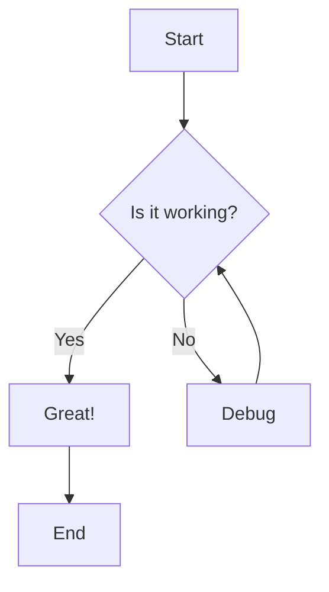
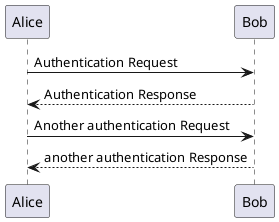
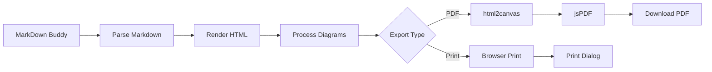

# PDF Export Test Document

This document tests the PDF export functionality of MarkDown Buddy with various content types.

## Text Content

Lorem ipsum dolor sit amet, consectetur adipiscing elit. **Bold text** and *italic text* should be preserved in the PDF export.

### Code Blocks

Here's some JavaScript code:

```javascript
function fibonacci(n) {
  if (n <= 1) return n;
  return fibonacci(n - 1) + fibonacci(n - 2);
}

console.log(fibonacci(10)); // Output: 55
```

And some Python:

```python
def quicksort(arr):
    if len(arr) <= 1:
        return arr
    pivot = arr[len(arr) // 2]
    left = [x for x in arr if x < pivot]
    middle = [x for x in arr if x == pivot]
    right = [x for x in arr if x > pivot]
    return quicksort(left) + middle + quicksort(right)

print(quicksort([3, 6, 8, 10, 1, 2, 1]))
```

## Tables

| Feature | Status | Notes |
|---------|---------|--------|
| Mermaid Diagrams | ✅ | Embedded as images |
| PlantUML Diagrams | ✅ | Cached and embedded |
| Syntax Highlighting | ✅ | Preserved in PDF |
| Headers/Footers | ✅ | Configurable |
| Multi-page | ✅ | Automatic page breaks |

## Mermaid Diagram



## PlantUML Diagram



## Lists

### Unordered List
- Feature 1
- Feature 2
  - Sub-feature A
  - Sub-feature B
- Feature 3

### Ordered List
1. First step
2. Second step
3. Third step
   1. Sub-step A
   2. Sub-step B

## Blockquotes

> This is a blockquote that should be styled properly in the PDF export.
> It can span multiple lines and should maintain its formatting.

## Links

- [Internal link](../README.md)
- [External link](https://github.com)

## Mathematical Content

Using inline math: The formula for the area of a circle is A = πr².

## Complex Mermaid Flowchart



## Final Notes

This document should export properly as a PDF with:
- All text formatting preserved
- Code blocks with syntax highlighting
- Tables properly formatted
- Diagrams embedded as high-quality images
- Proper page breaks and headers/footers